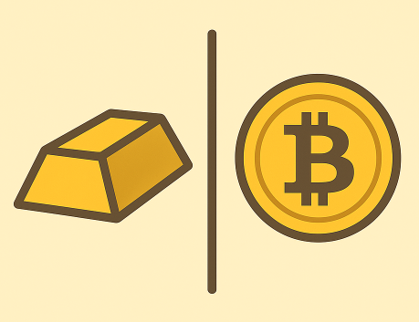

# On digital gold
_Revisiting PoW fundamentals_

([link to the Medium post](https://medium.com/@lunfardo/on-digital-gold-d1020984570b))

 

## Introduction

In this article, by **digital gold** we specifically mean a **decentralized digital scarcity** ensured by a Bitcoin-like proof-of-work (PoW) ledger. We compare it to physical gold, which is universal money (even though long ago gold lost some functions of money, such as serving as an everyday payment medium). Physical gold represents **monetary scarcity** and **universal collateral** - traits we also expect from its digital counterpart. We do not expect digital gold to serve as a universal (micro) payment medium.

Bitcoin's dominant narrative is that of a **decentralized store of value** - _digital gold_. In this write-up, we critically explore how well Bitcoin and other PoW currencies support that claim by revisiting their fundamentals.

Our main thesis is that the **cost profile makes Bitcoin and other PoW currencies poorly suited to serve as digital gold in the long term**. The main reason is that **they fundamentally do not scale with market capitalization**. By _long term_ we assume multi-decadal sustainability, not short-term market cycles.

The unbounded infrastructure costs of Bitcoin and other PoW currencies are the main obstacle. While physical gold scales naturally to market caps and economies of any size, it is difficult to imagine PoW currencies scaling to the current market cap of gold or entire economies (explained below). So far, Bitcoin has been a preferred investment target for many; however, whether it can behave like gold in the long term remains an open question.

The intended audience of this write-up is the general crypto public. Everyone is welcome to debate our statements if they disagree.

## Value and cost of gold
Gold sits in the sweet spot of physical and chemical properties required for that role of the monetary scarcity: scarce (but not excessively so), durable, divisible, fungible, and dense. The intrinsic utility of gold is technological and aesthetic, but that is irrelevant in the context of this article.

Gold has market value and liquidity-objective facts. Its value and role as universal collateral are also forms of utility, though not intrinsic ones. They are socio-economic implications of physical scarcity and other properties. Value-wise, gold is a speculative asset; that gives it liquidity and price, which in turn serve as evidence of a social agreement on its worth. Nobody signed this agreement, yet everyone **believes** it exists. Thus, the utility of gold as a value equivalent (money) stems from social consensus.

Now to the cost side. Every asset holder bears some **cost of ownership**. For physical gold, we can divide these into **existence costs**, **infrastructure costs**, and **dilution costs** (we omit opportunity costs related to financial risk).

_Existence costs_ are zero for gold: almost every atom of gold has existed for millions of years and will continue to exist.

_Infrastructure costs_ include mattresses, vaults, Fort Knox, and other security measures necessary in human society. Gold is physically resilient, but ownership entails the risk of loss. Infrastructure for gold is akin to record-keeping or custodial costs analogous to a ledger. Such costs are inevitable, yet we conjecture they are relatively small and almost constant. You could bury your gold bar under a tree, and that would cost you nothing.

_Dilution cost_ corresponds to the annual output of the gold-mining industry. Today, this is roughly 1.7 % annual inflation of the above-ground gold stock. As a gold owner, you are exposed to an annual debasement of about 1.7 % in gold terms. Expressed in fiat terms (omitted here), this provides a measure of total gold-mining cost and can be seen as a metric of gold's scarcity. (Note that during the Spanish _La Conquista_ the picture was different, and it could change again if someone brought a golden asteroid to Earth.)

Gold as a monetary scarcity does not depend on its dilution rate as long as that rate remains low. If all gold mining in the world suddenly stopped, gold would still retain the properties that make it a monetary scarcity.

## Value and cost of Bitcoin

We can generalize: any monetary scarcity - physical or digital - acquires the utility of money through some form of social agreement. **Scarcity** is the key word here, and it arises from the intrinsic properties of the "substance" used as money.

In crypto, we deal with **digital scarcity: a trustless (decentralized, trust-minimized) ledger of transactions**. This is crypto's main selling point. Digital scarcity has obvious advantages over the physical one - above all, global liquidity and fast transaction settlement.

The market value of Bitcoin stems from **shared belief and faith**, just like any other monetary scarcity. It has **no intrinsic value** such as future cash flows - only expectations. The idea that Bitcoin derives intrinsic value from the energy spent on mining is, in our view, groundless (we will not dig into it here).

Bitcoin's _dilution cost_ is deterministic and predictable. In the current halving cycle, it is 450 bitcoins per day, yielding about 0.83 % annual debasement. This is much lower than gold's rate and diminishes with every halving.

However, Bitcoin's cost profile differs substantially from gold's due to the fundamentally different nature of each.

Bitcoin mining generates a flow of coins to miners - around $20 billion per year in rewards plus fees (about 1 % of market cap at the time of writing). Most of this covers the OPEX (mainly electricity bills) and CAPEX of mining.

## PoW cost profile

All cryptocurrencies have existence and infrastructure costs because they exist on networks of computers. However, Bitcoin and other PoW coins stand out. Let's examine why.

In the current halving cycle, 450 new bitcoins are mined daily (≈164,250 per year). At $110,000 per BTC, this equals about $49.5 million per day or $18 billion annually in mining rewards. Suppose mining operations run at an average 30 % net profit margin (a reasonable ballpark). Total consolidated daily profit across all miners would then be about $14.8 million - representing market-equilibrium profitability for the Bitcoin-mining industry after accounting for costs, risks, and sentiment.

What happens if the price suddenly jumps 10 % to $121,000 due to market sentiment? That adds about 11,000 × 450 = $4.95 million per day to miners' profits. A miner would find itself earning ~$54.5 million daily net profit - a 40 % net profit margin, 10 % above equilibrium, which means increased ROI to the mining equipment.

If the price sustains, new miners will enter, following this above-equilibrium profitability and investing in more hashrate (it's permissionless!). This increases total cost, which in turn pushes profitability back to the 30 % equilibrium. In the long run, all costs are variable and profitability returns to equilibrium - basic microeconomics.

In addition, because the cost of attacking the network must scale with its value, miners compete until total security expenditure roughly matches potential gain from attack.

Conversely, if the price drops, miners downscale to cover costs. Bitcoin mining behaves like a production industry where costs ultimately follow output.

This model omits certain random and deterministic factors - halving tokenomics, fee-market dynamics, improving technology (cost per hashrate) -and cost follows price with delay. Still, the basic microeconomic pattern applies.

Following the analogy with gold, Bitcoin's CAPEX roughly corresponds to infrastructure costs, while OPEX corresponds to existence costs. Stopping all mining rigs would mean countless dead files in computers - Bitcoin would cease to exist.
The same reasoning applies to any PoW currency, whether blockchain (Bitcoin, etc.) or blockDAG (Kaspa).

The conclusion: **total mining cost for PoW currencies roughly follows token price (market cap)**. We can even conjecture proportionality - a ten-fold price increase implies roughly ten-fold higher costs (perhaps less; models are never perfect). This is a **causal relation**, not mere correlation. The increasing price makes total hashrate to grow, meanwhile, switching a mining rig on or off does not have direct effect on the price of Bitcoin.

Some say Bitcoin currently consumes electricity comparable to the power output of Poland. If its price reached $1 million per BTC - roughly the market cap of gold - its appetite would approach the power output of a significant part of the EU. In our view, this is infeasible. There is no simple mechanism to prevent it: it is a natural market reaction to increased mining profitability.

## PoW vs gold

Let us summarize.
Gold could easily survive a ten-fold increase in market cap because its infrastructure costs would grow far slower than price - roughly sub-linear. Perhaps that would spark a new Klondike Gold Rush - but likely not.

By contrast, **Bitcoin's existence costs are unbounded** because of the unbounded demand - costs tend to scale proportionally with market cap because higher prices incentivize additional mining until profitability normalizes. Even if gold's infrastructure costs are not negligible, Bitcoin's existence plus infrastructure costs are higher by order(s) of magnitude. Therefore, it is doubtful Bitcoin could even reach gold's current market cap.

When mining costs reach a "threshold of patience," either regulation or market forces (or both) will intervene. That is why Bitcoin is often said to be **unsustainable**. Our bet is on eventual global regulatory intervention - for example, taxation of Bitcoin-mining energy consumption - though no one can predict how it will unfold.

Bitcoin is scarce, but the energy it consumes is not inherently bounded by protocol, and it grows with the market cap grows. We do not want unbounded energy consumption on Earth for both environmental and economic reasons.

## Other scalability aspects

The fight for crypto scalability has mostly focused on throughput (TPS). Bitcoin's 7–10 TPS globally frustrate some users. Most faster blockchain protocols have achieved speed by compromising decentralization (e.g., PoS/BFT).

[Kaspa](https://kaspa.org) is a brilliant PoW protocol built on a DAG, offering several orders of magnitude higher transaction throughput than Bitcoin or other PoW blockchains. It is said that Kaspa solves the famous blockchain trilemma without sacrificing decentralization or security for scalability. Obviously, in Kaspa the cost per transaction must be several orders of magnitude lower than Bitcoin's while retaining all decentralization traits of PoW.

However, in our opinion, this does not change the PoW cost pattern described above. While Kaspa improves throughput efficiency, its security still depends on total hashpower, which in turn follows price. **The throughput parameter drops out of the total-cost equation when discussing the long term and assuming unbounded market caps**.

We need not even examine the GHOSTDAG protocol in detail. We expect Kaspa's total network hashrate to follow its token price. Although DAG topology improves throughput, it does not change the fundamental economic driver - miners still compete via energy expenditure. Once Kaspa replaces Bitcoin one day (as claimed), its market cap - and total cost - would approach Bitcoin's.

We intentionally leave aside many important details: incompatibility barriers of mining algorithms (ASIC/GPU/CPU), halving rate, tokenomics, fees, security metrics ("security per hashrate") and other. We believe that, in the long term, all these have only marginal impact, while the main cost pattern defines the future.

Gold has endured for millennia; if a digital equivalent is ever to match that longevity, it will likely require a more sustainable mechanism than PoW.