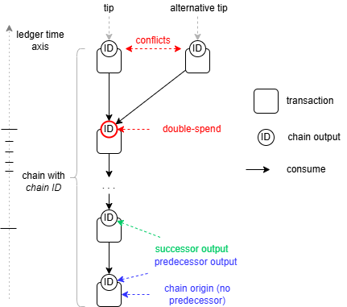

# UTXO constraints and ledger programmability

Proxima UTXO transactions are programmable. By adding validity constraints to UTXOs, user can set the validity conditions of the transaction and put specific unlock conditions of UTXOs. This way, user can pre-define future states of the asset, i.e. to program its behavior.

UTXO transactions are capable to update (consume) only finite, bounded and deterministic fragment of the otherwise unbounded ledger state. This makes the whole state update machine non-Turing complete. That why the EasyFL language intentionally does not have loops and does not allow recursive definitions. 

Programmability of the UTXO ledger essentially is **non-Turing complete, parallel and asynchronous smart contracts**, equivalent to finite state machines or even cellular automata. 

We avoid using term _smart contract_ for the Proxima programmability, because this name is usually applied to Ethereum-style smart contracts, that assume and can update (consume) unbounded infinite state, they are synchronous (atomically-composable) and therefore they need Turing-complete engine (a VM) with loops or recursion and unbounded data structures, in order to perform their logic.  

However, UTXO programmability may be seen also as a programming of the **emerging behavior** on the ledger, by multiple asynchronous and independent agents, which, at large, are capable to achieve arbitrary behaviors of assets. This makes the whole ledger a **quasi-Turing complete**. 

## Trust-less evidence of transaction data in UTXO 
In order to demonstrate power of UTXO programming with EasyFL constraint scripts, we will describe two examples. Both are implemented as standard functions in the ledger definition library, however they also can be put entirely inline, into the UTXO with relatively small overhead.

The problem of trust-less data in the UTXO is that in the ledger state where UTXO resides we do not have the transaction anymore. The transaction exists somewhere, because UTXO commits to the transaction with its *output ID*. However, the transaction is one "data availability trust assumption away": we know the transaction exists, but we cannot check its data without retrieving from somewhere. 

### Total produced amount
An example of the transaction level data we may want to use in the UTXO script, would be _total produced amount_, always available and enforced in the $T_6 = T^{ctx}_{0,6}$ of each transaction. Standard ledger function `txTotalProducedAmount` retrieves it in the context of the producing transaction: 
```
func txTotalProducedAmount : uint8Bytes(atPath(pathToTotalProducedAmount))
```

But when consumed, UTXO has no access to the transaction which produced it. If we just replicate the total produced amount value in the UTXO data, who could check if its is genuine.

The UTXO scripting comes to rescue. There's special validity constraint function `total` defined in the library:
```
// $0 - total amount uint64 big-endian
// $0 must be equal to the total amount value in the transaction
func total: require(
	or(
		selfIsConsumedOutput,
        equalUint($0, txTotalProducedAmount)
	),
    !!!total_amount_constraint_failed
)
```
This script fails in the produced UTXO, if argument of it is not equal to the total amount value, specified in the $T_6$ for the transaction. 

So, if somebody retrieves UTXO from the ledger state and finds constraint for example `total(1000000)` in it, she is absolutely confident that the total amount of produced outputs in the transaction was equal to exactly `1000000`, because if not, transaction would be invalid.    

### Trust-less message sender identity  
Another example of trust-less transaction data evidence on UTXO is UTXO messages with known sender. We want to include into the UTXO arbitrary data (message) together with secure evidence who produced the message, at least commitment to public key of the producer.

Note, that simply include message is not enough, because in general UTXO does not contain identity of the producer.

The natural use case for such a feature would be "sending" secure requests to L2 entities _on ledger_. Receiver of such a message can be a custodian of the tokens on behalf of the owner of the private key (who also owns account on L1). The custodian may take such messages embedded in UTXOs as commands to be performed on the assets owned by the same private key on L2: by retrieving UTXO the command will be secure, i.e. coming from the owner of the account.

(off-topic, in Proxima, _sequencers_ are an example of such L2 entities, that is how fund withdrawal from the sequnecers works)

Special constraint `msgED25519` function implemented in ledger definition library provides such functionality. 

```
// Contains arbitrary message and enforces valid sender (originator) as part of the message.
// Once output is in the state, it is guaranteed to have the real sender
// $0 - blake2b hash of the signature's public key (not an address, just data)
// $1 - arbitrary data
func msgED25519: or(
    // always valid on consumed output
	selfIsConsumedOutput,
    // valid on produced output only if public key of the signature of the transaction equal to $0
	and(
		selfIsProducedOutput,
		equal(
       		$0, 
			blake2b(publicKeyED25519(txSignature))
		),
        $1 // to enforce mandatory second parameter. It is evaluated
	)
)
```

Constraint script, say `msgED25519(0x1ce4df1ded3a8cebd503adb255bda0c949121bece9639363e940fbf1727472d6, 0x0102ff)`, when added to the produced output, means secure message `0x0102ff` from account `addressED25519(0x1ce4df1ded3a8cebd503adb255bda0c949121bece9639363e940fbf1727472d6)`. 

## Mandatory UTXO constraints
UTXO validity constraints on indices 0 and 1 are singled out. They are mandatory. At the index 0 must be an `amount` constraint, while at the index `1` must be one of known lock scripts.

### Amount
The amount constraint is more of a placeholder for the amount data: it only enforces the size of its argument and the index where it is located on the UTXO: 

```
// $0 - amount up to 8 bytes big-endian. Will be expanded to 8 bytes by padding
func amount: 
   require(
       // constraint must be at index 0 and arg0 must no more than 8 byte-long 
       and(equal(selfBlockIndex,0), lessOrEqualThan(len($0), u64/8)), 
       !!!amount_constraint_must_be_at_index_0_and_len_arg0<=8
   )
```

Note that amount can also be 0. The minimum storage deposit is enforced by locks.

### Locks

Lock defines minimal mandatory conditions for consuming the output (there may be other arbitrary unlock conditions too. They play special role in the transaction. In the current version of the Proxima ledger, we will mention the following lock scripts (in the future, locking functionality will be expanded):

* `addressED25519` (or short version `a`), aka `siglock`, enforces for the UTXO to be consumed, the transaction's signature must correspond to the lock's address (see [AddressED25519 lock](#addressed25519-lock)))
* `chainLock` lock requires particular chain output to be unlocked on the same transaction. Will be introduced together with the [chain constraint](#chain-constraint).
* `stemLock` special lock for branch transactions. It can be consumed by any other branch transaction, no signature is needed. It makes sequencers conflicting branch transactions, by intention;  
* `delegationLock` delegates tokens to the target chain. Two different addresses can unlock delegation lock with their private keys, however in different time slots

### Unlock parameters
In many cases, lock script requires a particular context in the transaction to be satisfied. For this, each constraint in the consumed output, including lock scripts, are expecting particular `unlock` parameters in the in advance known place in the transaction.

Let's say, current validation context path of the consumed output is $(1,0,i,j)$, i.e. bytecode of $T^{ctx}_{1,0,i,j}$ is being evaluated. Script can always access its unlock parameters at the path $(0,1,i,j)$.

The _unlock parameters_ is essential part of the UTXO programmability: the script cannot _dynamically search_ the transaction for needed data, it must be _statically pointed_ to the particular place with that data. Below we will provide several examples (such as consumed `chain` constraint requires to be provided with the index of the produced successor output).   

### AddressED25519 lock
We provide full EasyFL source for the ED25519 address lock. The lock function name is `addressED25519`, but we also provide short alias name `a`, so target addresses can be specified like `a(0x846446dfc5600ca372649df286018b6c3d7da3b6b6ec59cd511ec15157899e4c)`.

Note, that addresses and other locks in Proxima are not a passive data, but a formula, which, upon evaluation, will check itself if it is satisfied in the context or not.

```
// $0 self unlock parameters
func unlockedByReference: and(
    equal(len($0), u64/1),                     // prevent panic in compound locks
	lessThan($0, selfOutputIndex),             // unlock parameter must point to another input with 
                                               // strictly smaller index. This prevents reference cycles	
	equal(self, consumedLockByInputIndex($0))  // the referenced constraint bytes must be equal to the self constraint bytes
)

// $0 - ED25519 address, 32 byte blake2b hash of the public key
// Unlock data is 1 byte with reference index to the previous input or signature unlock with 0xff
func addressED25519: and(
	require(equal(selfBlockIndex,1), !!!locks_must_be_at_block_1), 
	enforceMinimumStorageDeposit,
	or(
		and(
			selfIsProducedOutput, 
			equal(len($0), u64/32) 
		),
		and(
			selfIsConsumedOutput, 
			or(
					// if it is unlocked with reference, the signature is not checked
				unlockedByReference(selfUnlockParameters),
					// checked if tx signature corresponds to the address
                equal($0, blake2b(publicKeyED25519(txSignature)))
			)
		)
	)
)

// short form of lock a(<hex bytes>)
// $0 - ED25519 address, 32 byte blake2b hash of the public key
func a : addressED25519($0)
```
In the "produced" context the lock script does not check anything more than syntactical validity of its argument: it must be 32 byte-long. 

If consumed, script checks unlock parameters, which supposedly can contain strictly smaller index pointing to analogous output, which has exactly the same lock bytecode. If it finds one, it means the previous one is unlocked, so the current one is as well.  

If there's no such reference (i.e. it is at the top of the list), script check if it's address data equal to `blake2b` hash of the public key of the transaction signature.  

This way we need calculate hash of the public key only once for multiple inputs.

Note, that the siglock script assumes valid signature of the transaction.

## Chain constraint
The `chain constrain` is one of central concepts in Proxima. It is used in many contexts, for sequencing, for delegation, UTXO NFTs. The very concept of the `inflation` is based on the _chain constraint_. See Proxima whitepaper or more details.

UTXOs (outputs) are one-time transient assets on the UTXO ledger. The UTXO disappears after consumed, some new are created on the ledger state instead, like particles in the particle accelerator. 

_Chain constraint_ introduces permanent, long-lived, non-fungible assets on the UTXO ledger.  Chain constraint implements concept if **mutable state** on the UTXO ledger. One can track history of the state, stored in such a chain-constrained UTXOs. It can be used many different contexts.  

The _chain constrain_ is implemented as a EasyFL script `chain` in the Proxima ledger library. The essence of it is simple: 
* each _chain constraint_ bears unique identifier, as 32 byte-long _chain ID_. 
* to be consumed by a transaction $T$ , UTXO with _chain constraint_ requires to be provided with and exactly one produced output on $T$ which is chain constrained with the same _chain ID_. The latter is called _successor_, while the consumed one is _predecessor_. 

This results in the chain of chain-constrained UTXO outputs, a `UTXO chain`.

<p style="text-align:center;"></p>

The source of the chain constraint function in EasyFL we provide [here](ledgerdocs/chain.md):

* each chain constraint bears as its argument: _chain ID_ and the location of the predecessor among consumed outputs: predecessor output and chain constraint index on it. So, constraint by its syntax enforces single predecessor; 
* chain origin is created without predecessor, but instead the _chain ID_ is all-zero value. The chain ID is deterministically assumed as `blake25-256` hash of the _output ID_ of the origin. **This guarantees unique chain ID** during the history of the ledger. This chain ID will be enforced in all UTXOs descended from the chain origin;
* in the consumed UTXO the `chain` constraint will require unlock data (2 bytes), which points to the successor output index and the `chain` constrain on it. The script will check if the successor have the same chain ID as itself. **This guarantees the single successor for each consumed chain constrained output** (unless chain is discontinued).  

This enforces exactly one UTXO with `chain` constraint with specific _chain ID_ on the ledger: essentially an NFT. It can be retrieved by _chain ID_ from the ledger index. 


### Chain lock

## Sequencer constraint

## Inflation

