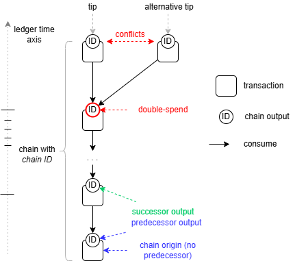

# UTXO constraints and ledger programmability
Proxima UTXO transactions are programmable. By adding validity constraints to UTXOs, a user can define the conditions under which a transaction is valid, as well as the specific unlock conditions for UTXOs. This allows users to predefine the future behavior of an asset — effectively programming it.

UTXO transactions can only update (consume) a finite, bounded, and deterministic fragment of an otherwise unbounded ledger state. This restriction makes the state-update machine non-Turing complete. Consequently, the EasyFL language intentionally excludes loops and recursion.

The programmability of the UTXO ledger in Proxima can be described as non-Turing complete, parallel, and asynchronous smart contracts, akin to finite state machines or even cellular automata.

However, we avoid the term "smart contract" in this context, as it typically refers to Ethereum-style SCs, which assume and can update (consume) unbounded infinite state, are synchronous (atomically-composable) and therefore need a Turing-complete engine (a VM) with loops or recursion and unbounded data structures to perform their logic.

Instead, UTXO programmability can be seen as **emergent behavior** on the ledger, driven by multiple asynchronous and independent agents. In aggregate, these behaviors can approximate arbitrary complexity, rendering the entire system **quasi-Turing complete**.

## Trust-less evidence of transaction data in a UTXO
A challenge in UTXO-based systems is that once an output resides in the ledger, the transaction that created it is no longer directly available. The UTXO commits to the transaction via its _output ID_, but verifying transaction-level data normally requires retrieving the transaction from external storage — introducing a trust assumption.

Proxima sidesteps this. As described in [transaction validation](txdocs/validation.md), every constraint is evaluated **twice** — once when its UTXO is produced and again when it is consumed — and the script knows, from its path in the transaction context, which case it is in (`selfIsProducedOutput` / `selfIsConsumedOutput`). A check placed on the **produced** side therefore pins a property of the producing transaction into the output itself. The output then becomes a **trustless witness** of that property: anyone holding just the UTXO can verify the fact, with no need for the original transaction. This is valuable for L1↔L2 interaction, where it relaxes data-availability requirements.

The simplest example is the standard signature lock. On the produced side, `sigLock` enforces that the holder ID stored in the output equals `blake2b` of the public key that signed the transaction. Once the output is in the ledger state, it is therefore self-evident who created it. More elaborate witnesses — native-token provenance (`token` / `tokenAmount`), redeemed local scripts (`redeemScript`) — are built on the same produced-side mechanism.

## Mandatory UTXO elements
A UTXO is a tuple of elements. The first three positions are fixed (see [Base data elements](txdocs/base.md)):

* **Index 0 — amounts vector.** A small tuple of values, not a script: token balance (element 0), inflation (element 1) and frozen coverage (element 2). It is parsed, never evaluated as bytecode.
* **Index 1 — index-value tuple.** Pure data used for ledger-state indexing: the controller / target / sender hashes. Position 0 typically holds the holder ID (for a signature lock) or the chain ID (for a chain lock). Parsed, never evaluated.
* **Index 2 — lock.** The first actual **script**: the bytecode that defines the unlock policy.

Positions 3 and up carry optional per-lock constraints (the chain constraint at index 3, and further extras after it). Only positions 2 and up are evaluated as EasyFL scripts.

### Locks
Locks define the minimum conditions for consuming an output. The current version includes:

* `sigLock` — signature lock: unlockable by the holder of the ED25519 key whose hash is the holder ID (see [Signature lock](#signature-lock)).
* `chainLock` — requires a specific chain output to be consumed in the same transaction. Introduced together with the [chain constraint](#chain-constraint).
* `stemLock` — used for branch transactions; unlockable without a signature.
* `delegateLock` — allows two different keys to unlock it, depending on timing (delegation).

### Unlock parameters
Constraints can’t dynamically search a transaction; they must reference known paths statically. A constraint at path $(1,0,i,j)$ (constraint $j$ of consumed UTXO $i$) reads its **unlock parameters** at $(0,7,i,j)$ — element 7 of the transaction is the tuple of unlock-parameter blocks, one per input. These parameters carry static references into the consuming transaction that the constraint needs (for example, the index of another input to reference for the signature).

### Signature lock
The signature lock ensures that an output can only be consumed by a transaction signed with a specific ED25519 key. It is an **argument-less** constraint: the holder ID lives in the index-value tuple (output element 1, position 0) and is supplied to the validation logic by the public wrapper:
```
// public 0-arg lock — holderID comes from the index-value tuple.
func sigLock : _sigLock(selfIndexValue(0))
```
On the **produced** side, `sigLock` requires the holder ID to be a 32-byte value (the `blake2b` hash of a public key). On the **consumed** side, the output is unlocked when either:

* the holder ID equals `blake2b` of the public key that signed the transaction, or
* the unlock parameters reference an earlier input (with a strictly smaller index) that is also `sigLock`-locked to the **same** holder ID — so that several inputs of one holder are unlocked by a single signature.

The full source is in `ledger/def/lock_signature.easyfl`.

## Chain constraint
The `chain` constraint is central to Proxima. It enables **mutable state**, NFTs, sequencing, delegation and other functions. Unlike standard UTXOs, chain-constrained outputs represent persistent, trackable assets.

Key properties:
* Each chain constraint encodes the _chain ID_ (24 bytes) and **predecessor** info, plus cumulative inflation, branch-bonus and counter fields.
* Chain origins are created with a zero chain ID, which is later replaced by the first 24 bytes of the `blake2b` hash of the origin's output ID.
* Each chain output must have exactly one **successor**, ensuring single-tip chains.

This enforces a single UTXO per chain ID on the ledger — essentially a native NFT. The `chain` constraint enforces a non-forkable chain of transactions on the ledger and always a single tip (UTXO) of that chain in the ledger state.

<p style="text-align:center;"></p>

The EasyFL source of the `chain` constraint is provided [here](ledgerdocs/chain.md).

### Chain lock
The `chainLock` is an advanced locking mechanism. It allows tokens to be locked to a chain instead of a static address. Whoever controls the chain (via the appropriate private key) can unlock the tokens — even if the controlling key changes. Like the signature lock, it is argument-less: the chain ID is read from the index-value tuple.

Chain locks are fundamental for:

* the tag-along mechanism;
* token custody with rotating keys;
* secure interaction with the sequencer chain (e.g. token withdrawal);
* trust-less interchain messaging.

The EasyFL source of the `chainLock` is provided [here](ledgerdocs/chain_lock.md).

## Sequencer constraint
The _sequencer constraint_ `sequencer` adds conditions on top of the `chain` constraint. A sequencer chain is a special kind of chain whose purpose is to support cooperative consensus among sequencers, by enabling branches, baselines and more. The sequencer constraint also carries the chain's delegation parameters (its epoch length and the maximum number of epochs it will freeze for).

## Inflation
The inflation constraint ensures deterministic inflation based on:
* ledger time (for general chains);
* verifiable randomness (for branches).

At the transaction level, the following invariant is enforced:
```
Total Consumed Amount + Inflation == Total Produced Amount
```
