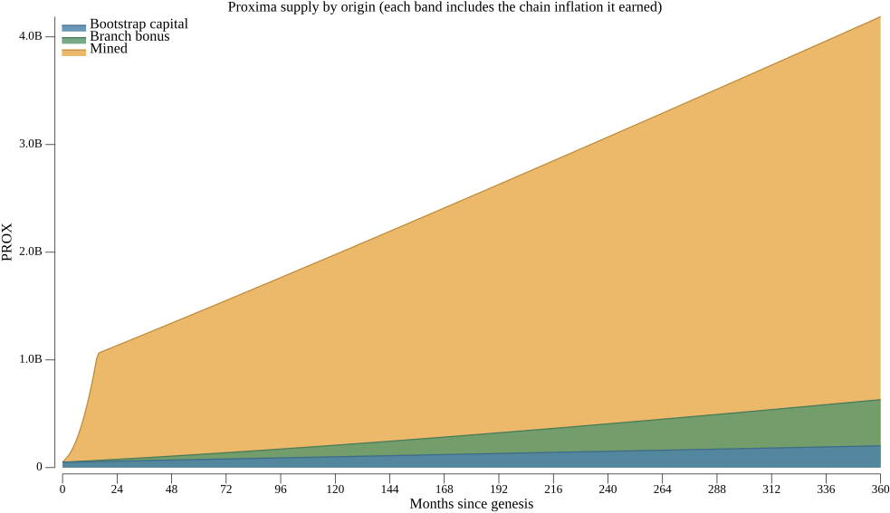
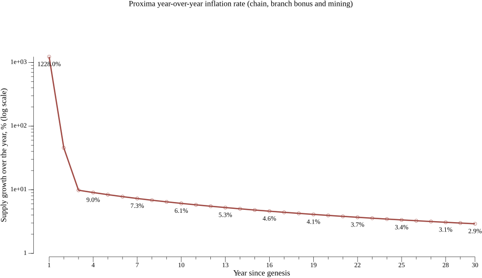

# Tokens and supply

Proxima's token is **PROX**. The smallest indivisible unit is the **mote**, and one PROX
is a million motes. Amounts inside the ledger are always counted in motes; PROX is the
unit people use when talking.

Two numbers are easy to confuse, so it is worth separating them at the start.

**One billion PROX is the base supply**: what genesis created, plus everything mining
will ever pay out. That figure is fixed, and mining ends when it is reached.

**The total supply is not fixed.** Inflation keeps adding to it, slot after slot, for as
long as the ledger runs. The base supply is a destination; the total is a number that
moves with ledger time and never stops.

## Slots: the ledger's clock

Inflation and mining are both measured per **slot**, so the word is worth introducing
first. A slot is Proxima's unit of ledger time, a little over ten seconds
(128 *ticks* of 80 milliseconds each). Roughly three million slots pass in a year.

Ledger time is not a node's wall clock. It is a shared reference every participant
agrees on, which is what lets independent token holders coordinate at all.

## Where the supply comes from

Most PROX does not exist yet. The base supply arrives from two places:

| Source | Amount | Share |
|--------|--------|-------|
| Bootstrap capital created at genesis | 50,000,000 PROX | 5% |
| Mined during the fair launch, the gradual decentralization process | 950,000,000 PROX | 95% |
| **Total base supply** | **1,000,000,000 PROX** | 100% |

Inflation is added on top of this, by continuous contribution to the consensus.

The remaining 95% sits on a single **mine chain** and is released gradually, one reward
at a time, to whoever competes for it. Mining requires no tokens to begin — it is the one
entry into Proxima that does not ask you to already hold some — and the reward is shaped
so that the whole of the mineable supply is emitted over roughly fifteen to seventeen
months rather than several years.

That release *is* the decentralization process: with every reward, a larger share of the
supply sits outside the founder's hands, and the influence the bootstrap capital started
with shrinks.

[The fair launch](overview/fair_launch.md) covers the philosophy and what has to be true
before Proxima can be called decentralized. [Mining](participate/mine.md) covers the
practical side of taking part.

## Inflation: two kinds

Alongside mining, the ledger creates tokens through **inflation**. Inflation is how the
consensus pays for itself, and the rule governing it is short:

> **Every token holder is entitled to inflation rewards for contributing to the
> consensus. Tokens that participate earn; tokens that sit still do not.**

Nobody is excluded and nobody needs permission — the entitlement follows from holding
tokens and putting them to work. But it is payment for *contribution*, not for ownership,
and the difference is the whole point.

### Not the inflation you are used to

The word carries baggage from two other places, and Proxima's inflation is unlike both.

**Fiat inflation** is the product of monetary policy — a decision made by an institution,
shaped by politics, and applied to holders who have no part in making it.
**Blockchain inflation** is usually a tax: new tokens minted for miners or validators,
paid for by diluting everyone who is not one.

Proxima's inflation is neither a policy nor a tax. It is:

- **equitable** — open to every participant on identical terms. There is no class that
  collects it and no class that merely pays for it;
- **merit-based** — earned by contributing to the consensus, in proportion to the
  contribution actually made;
- **predictable** — fixed by formula and computable in advance by anyone, with no
  schedule that can be revised and no discretion to exercise;
- **trustless** — defined by ledger rules that no authority controls, enforced by every
  node independently.

There are two independent kinds.

### Chain inflation

Chain inflation is the predictable one. Every **chained account** that contributes to the
consensus is rewarded in proportion to the capital it puts to work: an account bringing
twice as much earns twice as much. A chained account is an output that persists across
transactions instead of being spent away — the form tokens take while they are working.

The rate starts at roughly **10% a year** and declines slowly and permanently as the
ledger's total supply grows. Nothing about it is random and nothing about it is a
competition: it is the base return on capital that is being put to work.

The important qualifier is that **only chained accounts earn it**. Tokens sitting in an
ordinary output earn nothing at all, however many there are, and a holder who leaves them
there is diluted by everyone who did not. That is the disincentive working as designed:
there should be no class of passive holders in Proxima.

Nothing forces the choice. Every token is *incentivized* to take part, and the decision
belongs to whoever holds it — which is also why
[delegation](overview/delegation.md) exists, as the way to put tokens into a chained
account without running anything yourself.

### The branch inflation bonus

The second kind pays for the ledger being written down.

A **branch transaction** commits a consistent ledger state — the whole set of unspent
outputs as of that moment — to persistent storage. It is the point at which one version
of the ledger stops being a candidate among many and becomes settled and durable, the
thing later transactions are built on and the thing a node restarts from. Everything else
in the tangle is provisional until a branch commits it.

Producing one is real work, so the ledger pays for it. A sequencer that issues a branch
draws a bonus of at most **5 PROX**, produced by a verifiable random function from its
own signature. Nobody can predict the draw, nobody can grind for a better one, and
everybody can check it afterwards — random and trustless at the same time.

The randomness is there for a reason, and the reason is **tie-breaking**. Several
sequencers may commit competing versions of the state at the same moment, and the
consensus needs a decisive, ungameable way to prefer one of them — otherwise the network
splits over which commit to build on. The drawn bonus provides it: a branch that drew
more is worth more to build on, so the network converges instead of forking.

That competition is also why the bonus actually paid is **just below the 5 PROX maximum**
on average. What gets recorded is the winning draw, not a typical one — the branches that
drew poorly are the ones that lose. Reasoning from a single draw in isolation would
suggest something near half the maximum, and that is not what the ledger sees.

The amount is flat from genesis onward — it does not decay on a schedule. What falls over
time is its significance: five PROX a slot is a meaningful addition when the supply is
fifty million, and a rounding error once the supply is in the billions.

## How the supply behaves in the long run

Mining ends when the base supply is reached. Inflation does not end — it continues for as
long as transactions are issued, so the total supply keeps rising.

Taken together, chain inflation and the branch bonus are a **tail inflation**: a bounded
amount issued every slot, permanently, and open to every token holder rather than
reserved for a privileged set. Mining is the temporary part of the design and tail
inflation is the permanent one. Nothing switches it on or off, and there is no schedule
to run out.

It rises ever more slowly, though. Chain inflation is a proportional rate that declines
as supply grows, and the branch bonus is a fixed amount whose share of a growing supply
shrinks. The result is a steep launch flattening into a long, slow climb.

The first eighteen months are the whole of the mining phase: supply goes from the
50,000,000 PROX of bootstrap capital to about a billion, and the mined band — the tokens
that reached people by open competition — becomes and stays the largest part of the
supply. Each band includes the chain inflation the tokens in it earned, which is why the
bootstrap band keeps growing in absolute terms while shrinking as a share.

Year-over-year the picture is a cliff and then a gentle slope, which is why the chart uses
a logarithmic scale. The launch year is around 1,300% as mining floods in. Once mining
ends the rate drops to single digits — roughly 8% in year 3 — and declines steadily from
there, reaching under 3% by year 30.

Beyond the chart, the same arithmetic keeps going: no schedule ends it, and the rate keeps
falling. The ledger runs out of slot numbers to count time with roughly fourteen centuries
out, long before token amounts run out of room to be counted in.

## What you can do with tokens

Holding PROX and doing nothing is possible, and it earns nothing.

A small idle balance is normal, though, and nothing to avoid. Most holders keep something
like 100 PROX in an ordinary address-locked account as cash at hand — to pay tag-along
fees, to open or top up a delegation, to cover whatever a transaction needs. It earns no
inflation, and at that size it does not matter. What the design discourages is not petty
cash but capital left idle.

The design does not merely prefer that tokens participate — it requires it. A branch is
only produced when more than **7/12 of the coverage** stands behind it, so more than 7/12
of the supply has to be actively taking part at any moment. A Proxima where most tokens
sit still does not become a slow Proxima: it stops committing state altogether, and the
ledger stops advancing. This is why the inflation rules reward contribution rather than
ownership — the incentive and the requirement are the same thing seen from two sides.

Putting tokens to work means one of two things: **delegate** them to a sequencer, or
**run a sequencer** of your own. Delegating costs you a transaction and no more; running
a sequencer means operating software that takes part continuously, and is rewarded on
that basis.

**Running a full (access) node** is a third role, and needs no tokens. A full node
validates every transaction for itself, so it can vouch for the ledger state it holds
without trusting any peer; it is called an access node because it also hosts the API
through which people reach the ledger, and keeps the snapshots new nodes start from. It
earns no inflation, because inflation pays for contribution to the consensus and
validating is not contributing.

**Mining** is not a role at all but a way of *acquiring* tokens: it competes for the
supply not yet minted, needs nothing to start, and ends when the mineable supply runs
out. It is how tokens reach people during the launch, not how the consensus runs
afterwards.

Which one suits you, and what each costs and returns, is the subject of the next page.

## Where to go next

- [Taking part](overview/3-participate.md) — the roles above, in detail.
- [The fair launch](overview/fair_launch.md) — the philosophy behind how Proxima starts.
- [Delegation and liveness](overview/delegation.md) — putting tokens to work without
  running anything.
- [Taking part](overview/3-participate.md) — sequencer economics, custody and the rest.
- [How transactions work](overview/4-transactions.md) — how a chain transition mints
  the inflation described above.
- [Cooperative consensus](overview/consensus.md) — why participation is what makes the
  ledger safe.
- [Mining](participate/mine.md) — running the miner.
- [Join and contribute](participate/participate.md) — the practical guides.
