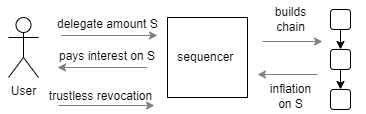
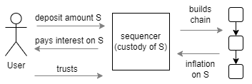

# Taking part

Proxima has no class of miners or validators to apply to join. There are only token
holders, and the consensus is whatever they do. That makes "how do I take part" a real
question with several answers, and this page is about choosing between them.

Two roles put tokens to work and earn inflation for it: delegating, and running a
sequencer. Running an access node is a third role — necessary infrastructure, but it
earns nothing. Handing tokens to a custodian is a fourth option, the one many holders
will actually take and the only one that asks you to trust somebody.

Mining sits apart from all of them. It is not a role in the running system but a
**bootstrap-phase way of acquiring tokens**, open while the supply is still being minted
and finished once it is.

The practical guides for each live in [Join Proxima](participate/participate.md). This
page is about what each role *is*, what it costs and what it returns.

## Putting tokens to work

### Delegation

Delegation is the option for a holder who wants the return without the operation. You
hand tokens to a sequencer of your choosing; it uses them to generate inflation and pays
you the agreed share. You keep ownership throughout.

The important property is that this is **trustless**. The tokens sit in a chained account
governed by a covenant — a set of constraints checked by every node before a transaction
is accepted. A transaction that let the sequencer walk off with your tokens is not a
transaction that honest nodes reject; it is not a valid transaction anywhere. What you
trust the sequencer for is narrow: to keep generating inflation while it holds your
tokens, and to honour a request to release them early.

The split is set when you delegate. Sequencers advertise a profit margin — the minimum
they keep — and compete on it. The sequencer also pays your projected share **up front**,
when it first freezes the delegation, so the return does not depend on the sequencer
staying healthy for the whole period.

Delegation costs one transaction and no infrastructure. For most holders it is the right
answer, and it is the one the miner takes automatically with what it mines.

[Delegation and liveness](overview/delegation.md) explains the mechanism;
[the delegation guide](participate/delegate.md) covers the commands.

### Running a sequencer

A sequencer is a token holder who participates continuously and professionally: building
a chain of transactions, folding other people's work into its own version of the ledger,
and committing state.

Sequencing is not a privileged office granted by the protocol. What exists in the ledger
rules is the **sequencer covenant** — a set of constraints a transaction can carry, which
grant it three abilities nothing else has:

* only a sequencer transaction can consolidate several ledger states by endorsing others,
  which is what makes convergence possible at all;
* only a sequencer transaction is eligible for the branch inflation bonus;
* only a sequencer transaction can freeze a delegation, which is what lets it put other
  people's tokens to work.

Beyond carrying that covenant, a sequencer is unconstrained. It may follow any strategy
it likes, and it is a self-interested player like everyone else. Proxima ships a
reference implementation, but it is only that — other implementations are expected, and
nothing in the ledger privileges ours.

A sequencer earns from four sources: chain inflation on its own capital, the branch bonus
when it wins one, tag-along fees from users whose transactions it pulls in, and the
margin it keeps on delegations. Against that it runs infrastructure, and it must hold
free balance to pay delegation advances up front.

Those advances are paid before the inflation that repays them has been earned, so a
sequencer that goes offline has still paid: the delegator's return is already secured and
the risk sits with the sequencer, not the delegator. It is a business with real costs and
risks, which is why the margin exists.

A sequencer node is not a separate species of node. It is a full node — the same one
described under [running a full (access) node](#running-a-full-access-node) below — with
a sequencer running on it as an add-on. Anyone operating a sequencer is therefore already
operating validating infrastructure, and everything true of an access node is true of
theirs as well.

[Running a sequencer node](participate/run_sequencer.md) covers the practical side.

## Custody: the option that asks for trust

In practice many holders will not delegate or sequence but **deposit** — handing tokens
to a custodian, most likely a crypto exchange or a layer-2 chain settled on Proxima. The
custodian generates inflation on the pooled deposits and pays interest, keeping a margin,
with rates set by competition much as in banking.

This is a legitimate strategy and it does contribute to the consensus — the tokens are
working rather than idle. But it is **not trustless**, and the difference from delegation
is the whole point. A custodian holds your tokens; a sequencer you delegate to never
does. Deposits carry counterparty risk and require the same kind of trust a bank does.

The risk narrows if the custodian is itself a decentralized or zk-proven system rather
than a company, but it does not vanish. Delegation exists precisely so that earning
inflation does not require making this trade.

**For now this route is not recommended.** Custody is worth exactly what the custodian is
worth, and Proxima is new: the ecosystem of reputable, well-established custodians that
would make the choice a reasonable one does not exist yet. Until it does, delegation
offers the same return with none of the counterparty risk, and there is little reason to
prefer a deposit over it.

## Mining: a way in, while it lasts

Mining is how the unminted 95% of the supply reaches people, and it is the only route
into Proxima for someone holding nothing at all: the work is CPU-bound, the fee comes out
of the reward, and no balance is required to start.

It is worth being clear about what it is not. Mining is not a standing role in the
consensus — it neither issues sequencer transactions nor commits state, and it earns no
inflation. It is a **temporary distribution mechanism**, the means by which the fair
launch moves tokens out of the founder's hands, and it stops for good once the mineable
supply is exhausted. After that the ways to take part are the ones above.

What a miner does with the proceeds is the part that lasts. Mined tokens sitting idle
earn nothing, which is why the miner delegates its rewards by default.

See [Tokens and supply](overview/2-tokens-and-supply.md) for what is being competed for
and [Mining](participate/mine.md) for running the miner.

## Running a full (access) node

An access node is a **full node**. It receives every transaction, validates every one of
them against the complete ledger rules, and builds its own copy of the ledger state. It
can therefore guarantee — on its own authority, trusting no peer — that the state it
holds is a valid one. It verifies rather than believes.

In other distributed ledgers a node doing exactly this is often called a **validator**.
We avoid that word, because elsewhere it usually names a member of a privileged, paid set
that produces or approves blocks, and Proxima has no such set. Validating the whole
ledger is simply what every full node does; it confers no standing and earns nothing.

The name we use points instead at what the node is *for*: it hosts the **API** through
which wallets, applications and people reach the distributed ledger. Access is the
service it provides.

Access nodes are also where new nodes come from. A node joining the network does not
replay the entire history to catch up — it starts from a **snapshot** of the ledger
state, and access nodes are what keep snapshots available to be fetched. Running one is
therefore a direct contribution to the network's ability to admit newcomers at all, which
matters more the larger the ledger's history grows.

It earns **no inflation**, because inflation pays for contribution to the consensus, and
an access node validates and relays rather than issuing transactions of its own. Running
one is infrastructure, not an investment — the natural first step for a developer, and
what anyone building on Proxima will want in front of them.

[Running an access node](participate/run_access.md) covers it.

## Getting a transaction included: tagging along

One more thing every token holder does, whatever role they take. To get a transaction
into the ledger you want a sequencer to pull it into its ledger state, and the way to
arrange that is to **tag along**: include an output paying a small fee to a sequencer of
your choice.

No special mechanism is involved — it is an ordinary output that happens to pay someone
who is motivated to include your transaction. The sequencer takes the fee and your
transaction comes along with it.

The risk is a sequencer that is inactive, or that simply ignores you. Then the
transaction may be orphaned. A transaction can carry several tag-along outputs aimed at
different sequencers, which is the straightforward defence.

## Choosing

| If you | The answer is |
|--------|---------------|
| hold tokens and want a return without running anything | **delegate** |
| want to take an active part and can run infrastructure | **run a sequencer** |
| are building on Proxima, or want to support the network | **run an access node** |
| want convenience and accept counterparty risk | **deposit with a custodian** — not recommended yet |
| hold no tokens and want in | **mine** — while the launch lasts, then pick a row above |

Delegating and sequencing are not exclusive, and neither excludes mining: a miner that
delegates its rewards is already doing both, which is what a miner does by default.

## Where to go next

- [Join Proxima](participate/participate.md) — the practical guides for every role here.
- [Delegation and liveness](overview/delegation.md) — the mechanism in more depth.
- [Cooperative consensus](overview/consensus.md) — why participation is what makes the
  ledger safe.
- [Tokens and supply](overview/2-tokens-and-supply.md) — what the inflation being earned
  actually is.
