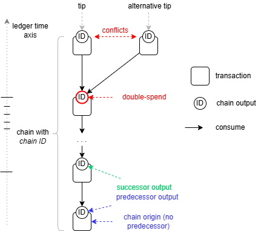

# How transactions work

Nothing on this page is needed to hold PROX, delegate it or run a node. It is here
because the rest of the overview keeps making a particular kind of claim — that a
sequencer *cannot* take your delegated tokens, that a chain *cannot* fork, that inflation
is fixed by formula and not by anyone's discretion — and this is where those claims stop
being assurances and become mechanics.

## A transaction is checked, not executed

A Proxima transaction consumes some outputs and produces others. That is the whole of it.
The outputs it consumes are deleted from the ledger state and the ones it produces take
their place.

What matters is that a transaction is **validated, not executed**. Its effect on the
ledger is fully determined before it is sent, by whoever sent it. Every node reaches the
same verdict independently, because the verdict is a function of the transaction and the
rules alone. There is no partial execution, no gas running out halfway, no result that
depends on the order things happened to arrive in. A transaction is either valid or it is
rejected whole.

[UTXO ledger](overview/utxo_ledger.md) covers the model itself — conflicts, past cones and
how transactions form the tangle.

## Outputs carry their own rules

An output is not just an amount and an owner. It carries **constraints**: small
validation scripts, embedded in the output, that any future transaction spending it must
satisfy.

This inverts the usual arrangement. The rules that govern an output are written by
whoever *created* it, and they bind whoever later consumes it. A lock — the constraint
saying who may spend — is only the most common example. Constraints can require that a
successor exists, that an amount is preserved, that a deadline has passed, that a
sequencer has signed.

The scripts are written in **EasyFL**, a small functional language of formulas. It is
deliberately not Turing-complete: there are no loops, no recursion and no unbounded
computation, so the cost of checking a transaction is knowable before it runs. This is
programmability aimed at *enforcing rules*, not at running programs.

A covenant such as the delegation lock is exactly this and nothing more: a set of
constraints, checked by every node, which no participant can talk their way around.

[The transaction model](txdocs/intro.md) has the detail;
[EasyFL](txdocs/easyfl.md) is the language.

## Chains, or chained accounts: identities that persist

An ordinary output is transient. It exists until something spends it, and then it is
gone. That is fine for moving tokens and useless for anything that needs to *persist* —
an account that accrues a balance, a sequencer, a delegation, a token issuer.

The **chain constraint** solves this. An output carrying it can only be spent by a
transaction that produces exactly one successor output carrying the same constraint. Not
zero, not two — exactly one. A chain therefore cannot fork, and cannot quietly end.

What that succession forms is called a **chain**, or equally a **chained account**. The
two words mean exactly the same and are used interchangeably here and in the software:
*chain* when the point is the unbroken succession of outputs, *chained account* when it is
the persistent thing that succession carries.

Each chained account has a 24-byte **chain ID** that never changes as the chain advances.
At any moment the ledger state holds **exactly one output for a given chain ID**, which is
the account's current state and can be looked up directly by that ID. What moves along the
chain — the balance, the data, the constraints — is mutable; the identity is not. This is
what makes it an account rather than a coin: a fixed name with a changing balance behind
it.

So a chained account is a permanent, non-fungible identity with a mutable state, built out
of transient outputs. Sequencers are chained accounts. Delegations are chained accounts.
So are token foundries and NFTs. Each is governed by a **chain controller**, the lock
deciding who may move it forward: an ordinary signature for a plain chain, a delegation
lock for a delegation.

## Inflation is minted by moving a chain forward

This is where the inflation of [Tokens and supply](overview/2-tokens-and-supply.md) comes
from, mechanically. When a chain advances, the successor may carry **more tokens than the
predecessor did** — new tokens, created by the transition itself and in proportion to the
balance already on the chain.

The rate is fixed by the ledger. For a chain holding *A* tokens moving forward at slot
*t*:

$$ A' = A \cdot (1 + R_t), \qquad R_t = \frac{1}{C + t} $$

*C* is a ledger constant — 30,303,030 on the main configuration — and because *t* grows
with ledger time, the rate declines permanently and predictably. Nobody sets it, and
there is no schedule to revise.

**One transition mints one slot's worth, and no more.** The amount is computed from the
slot of the predecessor, so a single transition claims a single slot's inflation however
long the chain has been standing still. Two transitions inside the same slot mint nothing
the second time — the ledger yields zero when successor and predecessor share a slot.

The consequence is the point of the whole design. To collect *k* slots of inflation you
must move the chain through *k* slots, a step at a time:

$$ A'_k = A \cdot (1 + k \cdot R_t) $$

Growth is **linear in ledger time** — but only for a chain that is actually being moved.
Leave one idle for a hundred slots and then move it once, and it earns one slot's worth;
the other ninety-nine are not banked, they are simply never minted.

This is not a penalty bolted on afterwards. Inflation pays for contributing to the
consensus, and a chain that is not moving contributes nothing to coverage — there is
nothing to pay it for. Constant movement of funds is exactly the behaviour the ledger
means to buy, which is why it is the only behaviour it pays for.

## Ledger time, and the pace

Every transaction and every output carries a **timestamp** measured in **ticks**. Genesis
is tick 0, and 128 ticks make one slot. A transaction's timestamp must be strictly
greater than the timestamps of everything it consumes, which is what makes the tangle
acyclic: a transaction can never reference its own future. Ticks are the resolution the
rules are written in; almost everything else — consensus, inflation, delegation — is
reasoned about in slots.

**Ledger time and clock time are different things.** Ledger time is a position on the
ledger's own axis, counted in ticks from genesis and carried inside the transaction.
Clock time is what a participant's clock happens to read. The two are tied by a fixed
correspondence: genesis is pinned to a real instant, and each tick is 80 milliseconds
after it, so a slot is 10.24 seconds and any ledger timestamp converts to a wall-clock
instant and back.

That correspondence is what makes cooperation possible. Each participant converts its own
clock into ledger time to know which slot is current, and so independent token holders
aim at the same slot without anyone having to agree on whose clock is right.

Timestamps are also subject to a **pace constraint** — a minimum gap between an output
and the transaction spending it. With the default pace of 12 ticks, an output stamped at
tick 1000 cannot be spent before tick 1012. Sequencer transactions run at a tighter pace,
because that is their job.

A transaction landing exactly on a slot boundary is a **branch**: the transaction that
commits a ledger state to persistent storage, described in
[Tokens and supply](overview/2-tokens-and-supply.md).

## Where to go next

- [UTXO ledger](overview/utxo_ledger.md) — conflicts, past cones and the tangle.
- [The transaction model](txdocs/intro.md) — the full technical treatment.
- [EasyFL](txdocs/easyfl.md) — the constraint language.
- [Native tokens](txdocs/native_tokens.md) — issuing assets other than PROX, using chains.
- [Redeemer scripts](txdocs/redeemer_scripts.md) — programmability beyond a fixed lock.
- [UTXO scripting](ledgerdocs/library.md) — the constraint library itself.
