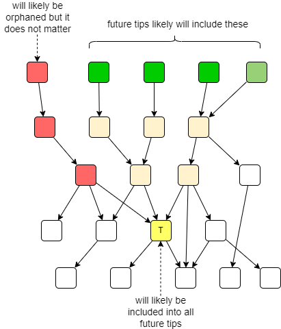
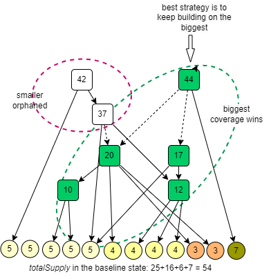
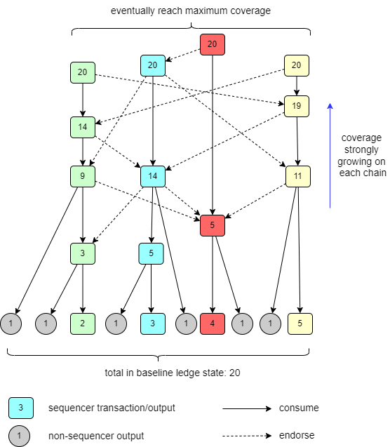
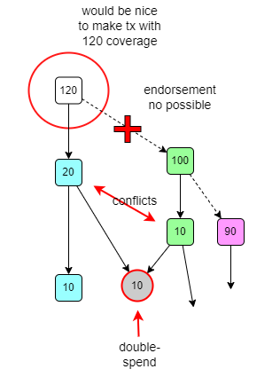
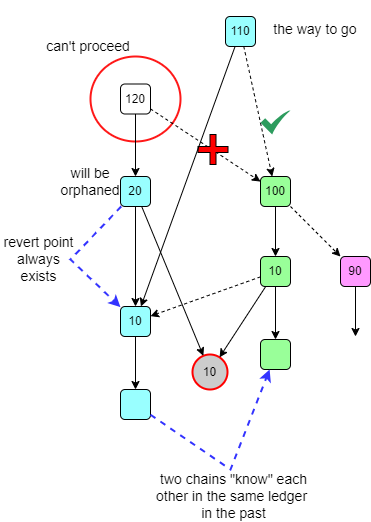
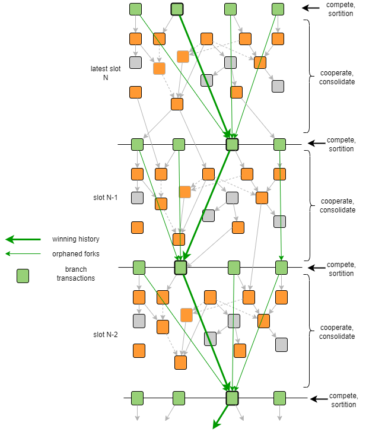
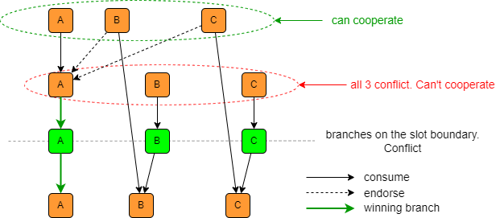

# Cooperative consensus

## General

Proxima ledger is organized as a *directed acyclic graph* (DAG), also known as [UTXO tangle](overview/utxo_ledger.md) or **transaction DAG**. Each vertex of the DAG is a plain UTXO transaction. Raw transaction bytes are the only message type participants need to exchange in order to build the _UTXO tangle_.

The *UTXO tangle* is built by token holders themselves rather than by block producers, who are incentivized third parties. The removal of third parties and related trust assumptions from the consensus is the whole point of the transaction DAG.

Each vertex $T$ of the UTXO tangle represents an individual ledger state $S_T$ (a set of outputs or UTXOs), which is the result of updating the genesis ledger state with the transactions from the past cone of $T$. 

The UTXO tangle keeps track of multiple versions of the ledger state in one data structure. One ledger state for each vertex. Some of them will be conflicting, while others not. The UTXO tangle is a *multi-ledger* data structure.

The goal of consensus among players is eventually agree on one single version of the ledger state, which **will be present in the history of any possible future transactions**. 

To reach this goal, Proxima uses a novel mechanism called **cooperative consensus**.

Cooperative consensus does not need "marshaling" transactions into blocks. It avoids related global bottlenecks. It also avoids PoW mining races and is energy-efficient. It is completely permissionless and does not require any BFT committee setup or other complexities and tradeoffs with decentralization. The system's Sybil protection is ensured similarly to PoS: by tokens on the ledger.

## Consensus on the transaction DAG
The main principle of the cooperative consensus - "each transaction approves two others" - was proposed in the original paper about [the tangle](https://assets.ctfassets.net/r1dr6vzfxhev/2t4uxvsIqk0EUau6g2sw0g/45eae33637ca92f85dd9f4a3a218e1ec/iota1_4_3.pdf). Proxima uses this concept and develops it even further.

The UTXO tangle grows by adding new transactions to it. It is driven by the decisions and preferences of the end-user of the system, the token holder. Each new transaction references other transactions, already existing on the UTXO tangle by consuming their outputs and *endorsing* them. Each new transaction $T$, once attached to the UTXO tangle, immediately becomes a **tip** of the DAG. At any moment, the UTXO tangle has a set of tips, which is constantly changing as new tips arrive.

Participants exchange transactions and each builds own copy of the UTXO tangle. Perception of the tip set will always be different for each participant due to the communication latency. However, the completed past cone of any transaction will be exactly the same for each participant.

Consensus on a particular transaction $T$ (and the corresponding ledger state $S_T$) is reached when there is a substantial guarantee for every participant in the network that transaction $T$ will be included in the past cone (history) of any future tip on the UTXO tangle. 

If transaction $T$ has no chance of making it to all future ledger states, it is considered **orphaned**.

The producer of transaction $T$, analyzes UTXO tangle and assumes certain behavior of other producers of transactions. 
When she convinces herself that chances of it to be orphaned become negligible, she considers transaction $T$ confirmed.

The consensus criterion above is _probabilistic and subjective_ by its very nature. User can only estimate the *chances* of how exactly UTXO tangle will develop in the future. Similarly, in the PoW blockchain, user estimates if the block with their transaction won't be orphaned by checking if it is deep enough (6 bocks) in the longest known chain, based on the assumption that miners will follow the longest chain rule.

In the cooperative consensus, it is assumed that all token holders follow the **biggest ledger coverage rule**.

In the game theory, an *optimal strategy* means, that, by deviating from it, participant will incur significant costs compared to sticking to it. (An everyday example of this kind of phenomenon -- Nash equilibrium -- is driving the right (or left) side of the road. We are quite comfortable when passing a car on the other side of the road because we know that for the other driver not to drive on the correct side may cost then their life)

In Proxima, we can assume that the absolute majority of the token holders will follow the biggest ledger coverage rule because it is the most profitable strategy, as per enforced validity constraints and [incentives](overview/incentives.md) on the ledger. So, new *tips* of the UTXO tangle will be appearing according to that rule with very high probability.

After sufficient amount of time, a user can be overwhelmingly convinced that once their transaction $T$ is included into the past cone of every tip of the UTXO tangle, it will remain that way in the future: their transaction become *confirmed*.

Token holder produces their transaction $T$ by consolidating chosen non-conflicting ledger states  proposed by other users in their transactions into an even "broader" ledger. This also acts as a cooperation mechanism, helping other transactions to be included in the bigger ledger state of $T$.

Next, each token holder will want their transaction $T$ to represent the "broadest" ledger state, therefore will search for the one to build $T$ on it.

The past cone of each transaction cannot contain conflicts as per ledger consistency requirements. It means transaction which conflicts with the "broadest" ledger will be *orphaned* (abandoned).

## Biggest ledger coverage

The intuitive concept of the "broadest" ledger needs to be quantified.

The **ledger coverage** of transaction $T$, denoted as $coverage(T)$, is the metric which tells how "broadly" the transaction $T$ covers outputs in the chosen past ledger state called the *baseline state*. It is calculated as a sum of amounts of all outputs consumed by the past cone of $T$ in the baseline state. The following picture illustrates this:

Each token holder produces their transaction with the biggest ledger coverage it is able to find in the constantly changing DAG at any given moment. This is the **biggest ledger coverage** rule.

The *biggest ledger coverage rule* is analogous to the *longest chain rule* in Bitcoin and other PoW blockchains. In Proxima, each token holder produces transaction that covers the maximum tokens in the baseline ledger state with their past cone.

The *ledger coverage* as defined above cannot grow forever. It will reach maximum when it will cover all outputs on the baseline state. So, the vanilla DAG does not suite the *biggest ledger coverage rule*. To overcome this and other challenges, Proxima enforces additional rules and incentives that make the *biggest ledger coverage rule* an optimal strategy on the UTXO tangle.

*Chains*, *sequencers*, *branches*, *inflation* are the ledger constraints enforced on the ledger (validity rules), that guides participants towards eventual consensus.

## Sequencers
*Sequencers* build chains of transactions called *sequencer transactions*. By design, only sequencer transactions are allowed to consolidate several ledger states by endorsing other sequencer transactions. For more about chains and sequencers, see the [incentives](overview/incentives.md).

The above makes the cooperative consensus in Proxima a cooperation among sequencers. Each sequencer issues its transaction with as big ledger coverage as possible in the dynamic context. "Consolidation" of the ledger states means consuming and endorsing other non-conflicting transactions in the past cone. By endorsing transactions produced by other token holders, a sequencer transaction can achieve bigger ledger coverage than its predecessor in the own chain. 
This way, the sequencer chain is always advancing by growing its ledger coverage. This is only possible when sequencers cooperate by consolidating others into their own ledger state.

### Conflict resolution
**Tl;dr**: double-spend (conflict) in the UTXO ledger effectively means fork of the ledger state, two conflicting ledger states. 
There's no special mechanism for conflict resolution: cooperative consensus naturally resolves conflicts by preferring ledger state with bigger 
coverage. The conflicting ones (with smaller coverage) becomes orphaned.

Transactions in the distributed UTXO tangle can conflict for various reasons. It is a common occurrence on the UTXO tangle. 
Ledger cannot contain conflicting transactions. Conflicts cannot be consolidated int the past cone of a vertex, each past cone in the UTXO tangle is enforced to be conflict-free.
 
How does the *biggest ledger coverage rule* handles conflict situations? For example, we cannot allow situations where sequencer **Blue** (see picture) cannot proceed with increased ledger coverage simply because both **Blue** and another sequencer, **Green**, accidentally spent the same output in their past cones. This scenario would make the system vulnerable to attacks.

The smart strategy for the token holder **Blue** is not to limit its options for the next chain transaction solely continuing the latest one. **Blue** may consider legitimate alternatives: fork points in the chain's past as long as they guarantee an increase in the current ledger coverage of the chain.

Sequencer **Blue** will revert its chain state to a point where it does not conflict with the latest state of another sequencer **Green**, which has the larger ledger coverage.

There is always a guaranteed *revert point* in the **Blue** chain that meets these criteria (we skip details here). The **Blue** can continue from that transaction. It serves as the basis for the next **Blue** transaction that can endorse **Green** without conflict.

This demonstrates how sequencers avoid conflicts and construct chains with growing ledger coverage.

The above diagram presents somehow simplified process. Sequencers expand their coverage not only by endorsing transactions on other sequencers but also by consuming *tag-along* and *delegation* outputs. When reverting their state, sequencers may lose their latest "achievements", however they will revert them in order to increase their ledger coverage.

Conflicts are common on the UTXO tangle. This turns the selection of the next transaction with the largest ledger coverage into an optimization problem for sequencer **Blue**. **Blue** must traverse all possible endorsement targets on the **Green** chain ($G_1, \dots, G_n$) and all potential revert points $R_{Blue}$ to identify the transaction with the maximum coverage.

Each sequencer chain can advance with growing ledger coverage through mutual cooperation. As sequencers endorse each other, while conflicting transactions are naturally orphaned from the main stream of chain transactions.

The above would be some kind of competition between sequencers on who is the best in cooperation. If sequencer does not cooperate by endorsing others, its transactions will likely be orphaned.

## Branches

The ledger coverage of any chain cannot expand indefinitely; it stops growing when its past cone encompasses the entire baseline ledger state. The total number of tokens on the ledger makes a hard cap on ledger coverage. Consequently, the biggest ledger coverage rule will ultimately converge to an equal maximum value for all sequencer chains.

To address this issue, we introduce **branch transactions**, also known as **branches**, which periodically "reset" ledger coverage at each slot boundary.

A *branch* is simply a sequencer transaction occurring at a slot boundary. We divide the ledger's timeline into slots and impose specific constraints when a sequencer chain transitions from one slot to the next with a branch transaction. While not mandatory, sequencer chains are incentivized to include a branch transaction at each slot boundary.

Slot boundaries and branches serve several crucial functions:

1. Each branch's ledger state is automatically stored in the database as a distinct ledger state. When a node verifies a valid branch transaction, it persists the corresponding ledger state in the multi-ledger database for access by other components. This branch's ledger state then becomes a potential baseline for transactions in the subsequent slot.
2. Branches occurring at the boundary of the same slot are intentionally conflicting ledger states. They are designed to consume outputs from the previous branch, referred to as the stem, effectively resulting in double-spends. A transaction cannot include two branches from the same slot in its past cone. Consequently, each transaction on the UTXO tangle will have a singular chain of branches in its past cone.
3. Sequencer transactions can endorse other sequencer transactions only within the boundaries of the same slot. Cross-boundary endorsements are forbidden on the ledger according to validity constraints.
4. If a sequencer chain lacks a branch at a specific slot boundary, it must endorse another sequencer transaction that does have a branch, either directly or indirectly.

Constraints 3 and 4 compel each sequencer transaction to explicitly determine to which baseline ledger state (branch) it belongs. Therefore, **each sequencer transaction is tied to a deterministic baseline state** that is universally recognized by all nodes. Sequencer transactions can endorse each other only if their baseline states do not conflict.

Constraint 2 ensures a single chain of branches, making the biggest ledger coverage rule a consensus rule. By adhering to this rule, the group of cooperating sequencers achieves consensus on a unified chain of branches, representing the singular historical evolution of the ledger state. Any branches not included in this chain are orphaned.

In essence, history is shaped by the most successful participants—those who cooperate effectively, often with a measure of good fortune.

### Selecting a branch
All branches on the same slot boundary are intentionally conflicting. Let's explore how the biggest ledger coverage rule manages conflict resolution among branches.

It's important to note that we adhere strictly to the same ledger coverage rule, keeping it as straightforward as possible: each sequencer aims to produce a valid next transaction in the chain with the maximum ledger coverage achievable within a given time period. We do not introduce any special transaction types or outputs beyond the requirement that transactions must satisfy immutable global ledger constraints.

Sequencers are incentivized to include branch transactions in their chains because only branch transactions can potentially include a random **branch inflation bonus**.

However, only one of several conflicting branch transactions will be incorporated into the future consensus ledger state. The determination of which branch survives is left to the biggest ledger coverage rule. This process resembles a kind of lottery among branches, with the outcome dictated by the rule favoring the transaction with the highest ledger coverage. Our goal is to ensure this lottery remains unbiased and fair.

Sequencer chains whose branches do not achieve the highest coverage (due to factors including the random branch inflation bonus) must revert back to the chain transaction from the previous slot and resume their chain from there. While they lose out on the branch inflation bonus lottery, they retain the ability to continue their chains uninterrupted.

Several questions still remain unanswered. Here are concise answers based on the Proxima whitepaper:

*What to do with ever-growing ledger coverage?*

The solution involves adjusting the calculation of ledger coverage by considering individual baseline states for each slot along the winning chain of branches. This is achieved by taking a weighted sum of ledger coverages for each baseline state, with weights exponentially decreasing as slots move further into the past.

*How to avoid bias of the *branch inflation bonus* lottery in favour of "richer" sequencers, i.e., those with more tokens?*

This kind of bias would be highly undesirable because it would mean the network will quickly centralize around the richest sequencers.

Proxima addresses this issue with a provably random branch inflation bonus. Using a verifiable random function (VRF), similar to Algorand's approach, sequencers are required to provide a pseudo-random yet deterministic (non-manipulable) value for new inflated tokens on each branch. The biggest ledger coverage rule then favors the branch with the highest branch inflation bonus for endorsement by other sequencers, irrespective of the token amount on the chain output. This approach ensures that the branch with the largest branch inflation bonus becomes the (random) winner of the branch lottery at the slot boundary, promoting fairness and equal opportunity among sequencers.

For more detailed analysis, please refer to the Proxima whitepaper.

