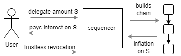

# Delegation and liveness

The cooperative consensus assumes that a significant majority of tokens must be participating in the consensus all the time. It effectively means that most of the tokens must be moved constantly, in each slot.

This fact presents a unique scalability challenge for the Proxima protocol, which is absent in other crypto ledgers. We envision millions of user accounts that should move their tokens constantly, so how exactly could we do that?

To address this challenge, we introduce the trustless ledger primitives of **frozen coverage** and **delegation**. 
The ledger primitives present special ledger validity constraints (also known as **covenants**), and are closely related to the concept of chains.

## Delegation

The main idea of the delegation is allowing sequencer, chosen by a _delegator_, to _freeze_ funds for a certain and capped period of time. During that period nobody can move frozen funds, but the frozen funds will be included into the ledger coverage of the sequencer chain. Sequencer will be able to use frozen token to generate inflation. After the freeze period is over, delegation covenant enforces _safe revocation slots_ during which owner of funds can move them as usually. This ensures liquidity of the delegated funds. 
For the frozen period of time, only the sequencer can consume the frozen output and only with the purpose of unfreezing it. 

The token owner wraps their tokens in the chain output, called the **delegation output**, and locks it with the **delegation lock**. 

The frozen funds in the delegation output do not move during the freeze period. In the testnet, the maximum freeze period is set by the delegator and can be between 1 and 12 hours. The safe revocation window is around 10 min.

The above means that funds are participating in the consensus and are generating inflation permanently, yet they are move once per 1 to 12 hours. That makes it possible massive participation of the capital in the security of the ledger for millions of accounts without overwhelming the network.

To compensate the delegator for the loan capital, the sequencer must deposit an **inflation advance** to the delegation output upon freezing it. This guaranteed the delegator will receive her inflation 
rewards after the freeze period even if the sequencer goes down. 

The exact proportions how inflation rewards are shared between the delegator and the sequencer are enforced according to the parameters set by the delegator and the sequencer, as two negotiating sides. In general, the whole process is market driven: for example, if the delegator considers the inflation margin required by the sequencer too high, she moves to the cheaper sequencer (or with better reputation score).

The guarantee that the sequencer cannot steal funds loaned to it is encoded in the delegation covenant (constraint script) in the form of enforced**safe revocation slots** during which only the delegator can consume the output. So, the delegator is guaranteed full control over her funds after the freeze period.

The safe revocation window is just an enforced guarantee for the delegator so that she could always take her funds back. In an absolute majority of cases though, the sequencer will return funds immediately upon request from the delegator. Note that in theory the sequencer may ignore the unfreeze request (sequencer is a token holder, a centralized and selfish entity). 
However, that is expected to be a rare even because by misbehaving, the sequencer will gain small amount short-term, yet it will suffer reputation costs and will lose income long-term.

With the inflation and the delegation mechanism, we achieve the following.
* each token holder is incentivized to delegate their holdings to sequencers of their choice, while enjoying full _liquidity of the delegated funds_. This is similar to the _liquid staking_ in PoS.
* sequencer is including the coverage of the frozen tokens in each slot without moving the UTXO. That results in _high liveness_ and high scalability (with respect to the number of accounts) of the protocol.

## Compulsory freezing of unused funds

Participation in the consensus is crucial for the safety and liveness of the system. For this reason, all participants in the Proxima ledger are incentivized to participate in the consensus by design.

However, there is no guarantee that all token holders will follow rational behavior for many reasons: neglecting the dilution costs, lost private keys, etc.

To address this problem, we introduce special ledger rules that enable and incentivize any sequencer to freeze any UTXO that has not been moved for more than a certain number of slots (say 24 or 48 hours). The **compulsory freezing** follows the usual delegation rules with the trusted revocation, a maximum of 12 hours of freezing, and the safe revocation window. This guarantees that the owner will never lose her funds, yet the funds will participate in the consensus.

In this way, we ensure high liveness of the system and high participation of the capital in the safety of the ledger without compromising scalability.
