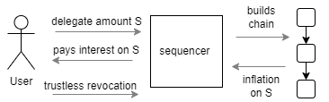

# Delegation and liveness

The cooperative consensus assumes that a significant majority of tokens must be participating in the consensus all the time. It effectively means that most of the tokens must be moved constantly, in each slot.

This fact presents a unique scalability challenge for the Proxima protocol, which is absent in other crypto ledgers. We envision millions of user accounts that should move their tokens constantly, so how exactly could we do that?

To address this challenge, we introduce the trustless ledger primitives of **frozen coverage** and **delegation**. 
The ledger primitives present special ledger validity constraints (also known as **covenants**), and are closely related to the concept of chains.

## Delegation

The main idea of delegation is to allow a sequencer, chosen by a _delegator_, to _freeze_ funds for a certain, capped period of time. During that period nobody can move the frozen funds, but they are still included in the ledger coverage of the sequencer chain, so the sequencer can use them to generate inflation. When the freeze period is over, the delegation covenant enforces a window of _safe revocation slots_ during which the owner can move the funds as usual. This guarantees the liquidity of the delegated funds. While frozen, only the sequencer can consume the output, and only to unfreeze it.

The token owner wraps their tokens in a chain output, called the **delegation output**, and locks it with the **delegation lock**.

The frozen funds do not move during the freeze period. The length of the freeze is measured in **delegation epochs**: each sequencer sets its own epoch length and its own ceiling on how many epochs it may freeze for, so the exact limit depends on the chosen sequencer. As a rough guide, an epoch is on the order of a couple of hours and a sequencer typically allows freezing for up to a day or so. After the freeze period, a short **safe revocation window** (60 slots, about 10 minutes) is enforced, during which only the owner can act on the funds.

This means the funds participate in the consensus and generate inflation continuously, yet they are only moved once per freeze period. That makes massive participation of capital in the security of the ledger possible — for millions of accounts — without overwhelming the network.

To compensate the delegator for lending their capital, the sequencer deposits an **advance** into the delegation output when it freezes it. This is the delegator's projected share of the inflation, paid up front, so the delegator receives the reward after the freeze period even if the sequencer goes down. The sequencer then earns that money back, plus its margin, from the inflation the frozen funds generate.

How the inflation is split between the delegator and the sequencer is set by the **inflation cut** — the share that goes to the delegator, expressed in _promille_ (parts per thousand, so `1000` is 100%). The delegator chooses the cut they require; a sequencer can accept the delegation only if the requested cut still leaves it at least its advertised **profit margin**. The whole process is market-driven: if a delegator considers a sequencer's margin too high, they move to a cheaper sequencer (or one with a better reputation).

The guarantee that the sequencer cannot steal the loaned funds is encoded in the delegation covenant as the enforced **safe revocation slots**, during which only the delegator can consume the output. So the delegator is guaranteed full control over their funds after the freeze period.

The safe revocation window is just a backstop that lets the delegator always take their funds back. In the vast majority of cases the sequencer returns the funds immediately upon request. In theory a sequencer (a token holder — a centralized, selfish entity) could ignore an unfreeze request, but that is expected to be rare: by misbehaving it gains a small amount short-term while suffering reputation costs and losing income long-term.

With the inflation and the delegation mechanism, we achieve the following:
* each token holder is incentivized to delegate their holdings to sequencers of their choice while enjoying full _liquidity of the delegated funds_. This is similar to _liquid staking_ in PoS.
* a sequencer includes the coverage of the frozen tokens in each slot without moving the UTXO. That results in _high liveness_ and high scalability (with respect to the number of accounts).

## Compulsory freezing of unused funds (planned)

Participation in the consensus is crucial for the safety and liveness of the system. For this reason, all participants in the Proxima ledger are incentivized to participate in the consensus by design.

However, there is no guarantee that all token holders will follow rational behavior, for many reasons: neglecting the dilution costs, lost private keys, and so on.

To address this, we plan to introduce ledger rules that would let any sequencer freeze a UTXO that has not been moved for a long time (say, more than 24 or 48 hours). This **compulsory freezing** would follow the usual delegation rules — trusted revocation, a capped freeze period, and the safe revocation window — so the owner would never lose their funds, yet the funds would participate in the consensus.

In this way, we ensure high liveness of the system and high participation of capital in the safety of the ledger without compromising scalability.
