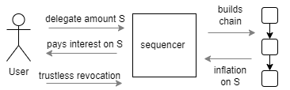

# Incentives

The only kind of participants with a genuine interest in the security of any distributed ledger are its end-users, the token holders. The rest must be incentivized to participate.

In Proxima, the token holder is the sole category of participants. Unlike in other distributed ledgers, Proxima doesn't need to incentivize third parties, such as miners or validators, to run consensus on behalf of the end-users and keep the ledger secure.

Proxima's ledger gives token holders the freedom to choose their own strategies within the bounds set by enforced constraints. To ensure predictable behavior, the ledger's constraints must provide the right incentives. Here we present the system of incentives on the Proxima ledger, their types, and how they work for different token holder strategies.

The philosophy behind Proxima's incentives for participants (token holders) is *equity*, *financial fairness*, and *active contribution to consensus and security*. Proxima treats all token holders equally while aiming to motivate contributions to the consensus and security of the ledger, disincentivizing "lazy" token holders who do not contribute to the consensus.

## Inflation on the chain asset

The main element of incentives in Proxima is _inflation on the chain_. Each token holder is entitled to build chains of transactions on the ledger and earn *inflation income* by creating tokens out of thin air proportionally to their holdings and time.

### Chain asset
Proxima introduces a novel concept of the UTXO ledger: a _chains_ and _chains assets_. Every permanent identity, which "lives" on the ledger while mutating its state is represented as a chain:  sequencers, delegations, accounts and NFTs.

The **chain** (also known as the *UTXO chain*) is a sequence of chain outputs (UTXOs) constrained by a special type of validation script (covenant) attached to the output and called a *chain constraint*. The chain constraint on the output, known as the *predecessor*, invalidates any transaction that does not produce the single next output in the transaction, called the *successor*. This enforces chain building, preventing the chain from forking into multiple chains on the ledger.

Each chain output in the chain bears a unique 32 byte-long ID called the *chain ID*. Thus, chain outputs form a non-forkable chain of transactions on the ledger, all marked with the same *chain ID*.

Looking from the perspective of the ledger state (also known as the _UTXO set_) it is not a chain, but the tip of it. 
There is always **exactly one chain output for a particular *chain ID* on the ledger state**. One can always retrieve that chain output by its *chain ID* from the ledger state.

Each chain effectively represents a permanent *non-fungible* asset, on the ledger with a unique ID. We call it **chain asset**. 
An ordinary UTXO is a temporary, transient asset recorded on the ledger. It disappears when consumed by a transaction. 
Contrary to an ordinary UTXO, the _chain ID_ remains on the ledger permanently, while UTXOs carrying it keeps being consumed and deleted from the ledger state. 

The *chain asset* has a state consisting of fungible tokens on the output, known as *on-chain tokens* or the *on-chain balance*, plus any other data and/or constraints. It is a *mutable state* of the chain asset. The chain output is always locked by a mandatory lock constraint called the *chain controller*, which usually is ordinary ED25519 account or *delegation lock*. *Chan controller* defines who, how and when can consume the chain output, mutate its state and produce next state with same _chain ID_ (successor). It is also called _state transition_ of the chain.

Chain constraints are used to build [sequencer chains](overview/consensus.md), for delegation outputs, NFTs, and other ledger constructs that represent a single (sub)state of the ledger state.

A unique feature of the chain asset in Proxima is that, by updating its state, a token holder **can create new tokens out of thin air** (inflation) proportionally to the on-chain tokens in the predecessor.

### Ledger time

Each token holder can earn inflation income by building a chain of transactions. The underlying idea of this type of income is the common financial concept of ["time is money"](https://en.wikipedia.org/wiki/Time_value_of_money). In Proxima, this takes the form of *ledger time is money*. 

The *ledger time* is an ever-growing integer number of time **ticks** assigned to each transaction and each output. It is also called *timestamp*. 
The ledger time of genesis outputs is $0$ ticks. $128$ ticks make a **slot**. The transaction timestamp is enforced to be strictly greater than the timestamps of its inputs. When $128$ divides the timestamp with a residual 0, the transaction is on the *slot boundary*.

Timestamps of outputs and transactions are subject to *pace constraints*, such as a minimum number of ticks between successor and predecessor transactions. For example, if an output has a timestamp of $1000$ ticks, the consuming transaction must have a timestamp of at least $1005$.

### Inflation
Let's say some chain output $O_t$ is an UTXO on the slot $t$ and it has a balance of $A$ tokens on it. This balance is controlled by the private key of the chain controller.

According to the chain constraint (covenant), the token holder can create up to $I_t$ new tokens on the successor output, representing the inflation on the chain.
Let's say $A$ and $A'$ is an amount of tokens on predecessor and successor outputs respectively. Then:

$$
A' = A + I_t
$$

The validity constraints enforces that if successor output is on the same slot, $I_t = 0$, i.e. no inflation on the same slot.

Otherwise, 
$$ 
I_t = A \cdot R_t
$$
where $R_t$ is an inflation rate. The inflation rate $R_t$ is variable. It depends on the slot and declines with the ledger time. It is defined as follows:
$$
R_t = \frac{1}{C+t}
$$

The ledger constant $C$ defines how steep the decline is. 

Note that number of new tokens $I_t$ does not depend on how far (in terms of ledger time) the successor output is: $I_t$ will be the same if successor will be in the next slot $t+1$ or in $t+1000$. That is by intention: we want to incentivize building chains non-stop: producing new successor output each slot is the only way to inflate you token holdings constantly. This is the behavior of token holders we want to incentivize: constantly moving tokens and this way contributing to the security of the ledger. 

In the testnet, $C=30,303,030$. Assuming 1 slot corresponds to 10 sec of the real time and tokens are moved every slot, maximum achievable yearly inflation rate for first 5 years will be as follows:

| year | YoY inflation rate |
|------|--------------------|
| 1    | 10.41%             |
| 2    | 9.43%              |
| 3    | 8.61%              |
| 4    | 7.93%              |   
| 5    | 7.35%              |

Note that the actual inflation will be somewhat lower because not all token will move all the time (more on it below).

**TBD >>>>>>>>>>>>>>>>>>>>>>>>>>**

The amount $I$ is proportional to the $amount(A)$ and to the ledger time in ticks between outputs $A$ and $A'$. Let's denote the ledger time duration in ticks between transactions as $\Delta T$.

The inflation amount for one step of the chain is:
$$
I = amount(A) \cdot \Delta T \cdot R
$$

Here $R$ is the **inflation rate**, an immutable constant on the ledger. (formula here is a bit simplified)

This way, every token holder can inflate their holdings by building chains. There is no other way to create new tokens in Proxima.

Note that the maximum amount of inflation generated on the ledger per year is capped at $totalSupply \cdot R_{annual}$. Here, $R_{annual}$ is the annual inflation rate, while $totalSupply$ represents the total number of tokens on the ledger at the beginning of the year.

Token holders who do not build chains will be diluted and will incur an opportunity cost equivalent to the "lost" tokens they could have otherwise created. This serves as a strong incentive to build chains.

To further incentivize continuous chain building, ledger constraints include an **inflation opportunity window** constant (spanning 1 or several slots), which sets the upper bound for $\Delta T$, after which inflation $I$ will flatten. This incentivizes token holders to issue chain outputs at least once every few slots. Lazy or slow token holders will miss the opportunity to generate income.

In addition to the inflation $I$, a random branch inflation bonus is added at each slot boundary. This incentivizes the issuance of *branch transactions* on the chain, which are necessary for the cooperative consensus.

The intentions behind these incentives are:

- To incentivize token holders to contribute to the security of the ledger through chain building (*sequencing* and *delegation*). See [cooperative consensus](overview/consensus.md).
- To ensure *equity* and *financial fairness*. Each active token holder can expect a fair, proportional, and predictable return on their *skin-in-the-game* on the ledger.

It is reasonable to expect that some token holders will keep a certain amount of their holdings in passive wallet addresses, similar to how we keep some cash in our wallets or stash it under the mattress. This is their right. However, those funds won't be return-generating capital, resulting in a financial cost for the owner. This, however, makes sense as a limited cash (liquidity) reserve on the ledger.

The intended behavior for the absolute majority (significantly more than 50%) of funds on the Proxima ledger is to contribute to the security of the ledger by building chains for the cooperative consensus.

### Inflation on transaction

The inflation $I$ represents maximum inflation on an output. For convenience, the inflation constraint is enforced at the transaction level. Let's denote $S$ as the sum of input amounts and $S'$ as the sum of output amounts.

For a transaction to be valid, it must satisfy the following condition:
$$
S' \le S + I_{sum}
$$    
where $I_{sum}$ is sum of the upper inflation bounds $I$ of all chain outputs produced by the transaction.

This condition allows for the distribution of newly created tokens among multiple outputs produced by the transaction.

## Sequencers
*Sequencers* are "professional" token holders who consistently build *sequencer chains* to earn inflation. By design, only sequencer chains can consolidate multiple ledger states, thus contributing to the consensus. Additionally, only sequencers are eligible to win the *branch inflation bonus*. 

Sequencers are critical for the security of the ledger. Sequencers will be running at least one node and other infra, so they will incur direct costs. 
Becoming a sequencer is a voluntary decision for each token holder and represents one of several possible strategies for participating in the ledger.
Our intention is:
- to provide incentives to run a sequencer 
- to enable sequencers to earn additional income to offset costs. _Branch inflation bonus_ and the [tag-along mechanism](#tag-along-mechanism) serves that
- to prevent very small sequencers. Minimum token balance on the sequencer chain serves that 
- to prevent big concentration of capital by few sequencers. Inflation rate on sequencers diminishes with sequencer balance, so huge sequencers will suffer smaller ROI  

### Deposits and custody
What are *sequencers* beyond being token holders with significant assets?

In general, sequencers will predominantly be large **custodians**, such as **crypto exchanges** or **L2 chains** enshrined on the Proxima ledger, either trusted or zk-proven.

By taking tokens into custody on its chain on behalf of other token holders, a custodian can generate inflation from these deposits. Consequently, it is reasonable for the original token holder to expect interest on their deposited holdings from the sequencer.

The sequencer/custodian will pay interest on the deposit, potentially retaining a margin from the generated inflation. The specific charges and rates will be determined by competition in the custody market, similar to practices in the banking sector.

Depositing funds with a sequencer is one of several strategies for ordinary (non-sequencer) token holders to protect their holdings from the diluting effects of the on-ledger inflation.

By depositing funds with a sequencer, token holders also contribute to the security of the cooperative consensus and the overall ledger.

However, custody involves **counterparty risk** and the need for **additional trust**: a crypto exchange or L2 chain must be trusted, much like banks. Depositing tokens off-ledger will always require additional trust assumptions, meaning it is **not trustless**.

On the other hand, the sequencer may also be a decentralized or zk-proven system itself, thereby mitigating these risks.

### Delegation
A **trustless** alternative to depositing funds with a sequencer is **delegation**, which does not require additional trust. Token holders can delegate their funds to a sequencer to generate inflation on their behalf without giving the sequencer control over their tokens.

_Delegation_ is similar to the _staking_ in the PoS ledgers. It is enshrined into the immutable logic of the ledger. 

To delegate, a token holder places a certain amount of tokens into a chain output. The special **delegation lock** grants the chosen sequencer the right to consume the delegated output in the sequencer transaction by producing a chain successor in the same transaction *without the ability to remove tokens from the delegated chain*. Thus, the sequencer can generate inflation from the delegated tokens but cannot "steal" those tokens.

The **revocation prescription** provided in the delegation output allows the delegating party to take back the delegated output according to the prescribed rules. The revocation prescription is based on ledger time-sharing and offers various options: delegation may have a deadline, it may be returnable every fifth slot, or similar conditions. When the revocation condition is met, the token holder can consume the output and override the delegation conditions, for example, by delegating the tokens to another sequencer. Race conditions and potential double-spends do not occur, as either the delegating party or the sequencer can consume the output at a particular time, but never both.

The sequencer will use the delegated funds in its sequencer transactions to generate inflation. Whether the sequencer takes a *delegation margin* from the generated inflation is a matter of competition among sequencers in the market.

### Branches
_Branch_ in the Proxima ledger refer to sequencer transaction occurring precisely on a slot boundary. 

Just like any other transaction, branch transaction seeks inclusion in the consensus ledger state. However, by intention we enforce all branches on the same slot boundary consume one predecessor branch from the previous slot. That makes all branches on the same slot boundary a conflicts (double spends). This results in tree of branches that, in turn, ensures the convergence of the distributed ledger system towards a global consensus, similarly to blockchains.

In a branch transaction, a **verifiably random inflation bonus** amount $B$ is enforced uniformly over a specific interval, distinct from the regular inflation rules described earlier. This random inflation bonus is crucial for determining which branch will be included in the consensus ledger state according to the biggest ledger coverage rule (refer to [Cooperative consensus](overview/consensus.md) and the Proxima whitepaper for detailed explanations). Sequencers participate in a fair lottery for this branch inflation bonus on every slot boundary.

Therefore, in each slot, a sequencer earns inflation of at least
$$
I=amount(T) \cdot R_{slot}
$$
or, if fortunate enough
$$
I=amount(T) \cdot R_{slot} + B
$$

The branch inflation bonus serves as a significant incentive for token holders to operate as sequencers, as only sequencers have the opportunity to win this bonus.

## Tag-along mechanism

*Tagging-along* is a strategy used by any token holders to incentivize a chosen sequencer to include their transaction in the sequencer's ledger state.

*Tagging-along* does not require any special mechanism. The producer of the transaction simply includes an output that sends a specified amount to the chosen sequencer. This output, known as the **tag-along output**, contains the **tag-along fee**.

The sequencer is naturally motivated to include this tag-along output in their ledger state. Consequently, the entire transaction (or connected bach of transactions), along with any chain transitions and associated inflation, becomes part of the cooperative consensus on the ledger state. Non-sequencer user essentially "bribes" the chosen sequencer to include the transaction in their ledger state.

There is a risk, if the tagged-along sequencer is inactive or does not consume the tag-along output for any reason (censor them). 
In such cases, the transaction could be orphaned. To mitigate this risk, the transaction can include several tag-along outputs targeting different sequencers.

In summary, tagging-along leverages the tag-along output to persuade sequencers to include transactions in their ledger state, thereby participating in the cooperative consensus and potentially earning inflation without being a sequencer themselves.

