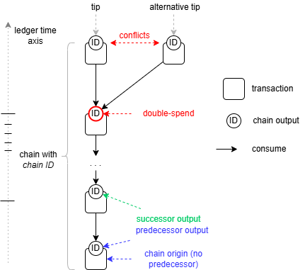

# Incentives

The only kind of participants with a genuine interest in the security of any distributed ledger are its end-users, the token holders. The rest must be incentivized to participate.

In Proxima, the token holder is the sole category of participants. Unlike in other distributed ledgers, Proxima doesn't need to incentivize third parties, such as miners or validators, to run consensus on behalf of the end-users and keep the ledger secure.

Proxima's ledger gives token holders the freedom to choose their own strategies within the bounds set by enforced constraints. To ensure predictable behavior, the ledger's constraints must provide the right incentives. Here we present the system of incentives on the Proxima ledger, their types, and how they work for different token holder strategies.

The philosophy behind Proxima's incentives for participants (token holders) is *equity*, *financial fairness*, and *active contribution to consensus and security*. Proxima treats all token holders equally while aiming to motivate contributions to the consensus and security of the ledger, disincentivizing "lazy" token holders who do not contribute to the consensus.

## Inflation on the chain asset

The main element of incentives in Proxima is _inflation on the chain_. Each token holder is entitled to build chains of transactions on the ledger and earn *inflation income* by creating tokens out of thin air proportionally to their holdings and time.

### Chain asset
Proxima introduces a novel concept of the UTXO ledger: a _chains_ and _chains assets_. Every permanent identity, which "lives" on the ledger while mutating its state is represented as a chain:  sequencers, delegations, accounts and NFTs.

The **chain** (also known as the *UTXO chain*) is a sequence of chain outputs (UTXOs) constrained by a special type of validation script (covenant) attached to the output and called a *chain constraint*. The chain constraint on the output, known as the *predecessor*, invalidates any transaction that does not produce the single next output in the transaction, called the *successor*. This enforces chain building, preventing the chain from forking into multiple chains on the ledger.

Each chain output in the chain bears a unique 32 byte-long ID called the *chain ID*. Thus, chain outputs form a non-forkable chain of transactions on the ledger, all marked with the same *chain ID*.

Looking from the perspective of the ledger state (also known as the _UTXO set_) it is not a chain, but the tip of it. 
There is always **exactly one chain output for a particular *chain ID* on the ledger state**. One can always retrieve that chain output by its *chain ID* from the ledger state.

Each chain effectively represents a permanent *non-fungible* asset, on the ledger with a unique ID. We call it **chain asset**. 
An ordinary UTXO is a temporary, transient asset recorded on the ledger. It disappears when consumed by a transaction. 
Contrary to an ordinary UTXO, the _chain ID_ remains on the ledger permanently, while UTXOs carrying it keeps being consumed and deleted from the ledger state. 

The *chain asset* has a state consisting of fungible tokens on the output, known as *on-chain tokens* or the *on-chain balance*, plus any other data and/or constraints. It is a *mutable state* of the chain asset. The chain output is always locked by a mandatory lock constraint called the *chain controller*, which usually is ordinary ED25519 account or *delegation lock*. *Chan controller* defines who, how and when can consume the chain output, mutate its state and produce next state with same _chain ID_ (successor). It is also called _state transition_ of the chain.

Chain constraints are used to build [sequencer chains](overview/consensus.md), for delegation outputs, NFTs, and other ledger constructs that represent a single (sub)state of the ledger state.

A unique feature of the chain asset in Proxima is that, by updating its state, a token holder **can create new tokens out of thin air** (inflation) proportionally to the on-chain tokens in the predecessor.

### Ledger time

The *ledger time* is an ever-growing integer number of time **ticks** assigned to each transaction and each output. It is also called *timestamp*. 
The ledger time of genesis outputs is $0$ ticks. $128$ ticks make a **slot**. The transaction timestamp is enforced to be strictly greater than the timestamps of its inputs. When $128$ divides the timestamp with a residual 0, the transaction is on the *slot boundary*.

Timestamps of outputs and transactions are subject to *pace constraints*, such as a minimum number of ticks between successor and predecessor transactions. For example, if an output has a timestamp of $1000$ ticks, the consuming transaction must have a timestamp of at least $1005$.

### Inflation

Each token holder can earn inflation income by building a chain of transactions. The inflation amount is proportional to the length of the chain.  
The underlying idea of this type of income is the common financial concept of ["time is money"](https://en.wikipedia.org/wiki/Time_value_of_money). In Proxima, this takes the form of *ledger time is money*. 

The intention is to incentivize constant movement of funds on the ledger. That, in turn, disincentivizes lazy holding, because not inflating tokens means exposure to the dilution cost.   

Let's say, _Alice_ creates a chain output on the slot $t$ with $A$ tokens on it. She then can create a transaction with the successor output with balance of tokens $A'$.
Of the next transaction is in the next slot $t+1$ or later, new tokens can be created on the successor:

$$
A' = A + A \cdot R_t =  a \cdot(1+R_t)
$$
where $R_t$ is **inflation rate**. The inflation rate $R_t$ is variable. It depends on the slot and declines with the ledger time. It is defined as follows:
$$
R_t = \frac{1}{C+t}
$$

The ledger constant $C$ defines how steep the decline is. 

If we have a chain of $k$ chained outputs one each slot (i.e. chain is $k$ slots long), the resulting amount will grow linearly with the ledger time:

$$
A'_k = A + A \cdot k \cdot R_t =  A \cdot (1+ k\cdot R_t)
$$

We call this convenient property **linear inflation**.

The intentions behind these incentives are:

- To incentivize token holders to contribute to the security of the ledger through constant movement of funds. See [cooperative consensus](overview/consensus.md).
- To ensure *equity* and *financial fairness*. Each active token holder can expect a permissionless, fair, proportional, and predictable return on their *skin-in-the-game* on the ledger.

Assuming 1 slot corresponds to 10 seconds of the real time, and $C=30,303,030$ and tokens are moved every slot, maximum achievable annual inflation rate for the first 5 years will be as follows:

| year | YoY inflation rate |
|------|--------------------|
| 1    | 10.41%             |
| 2    | 9.43%              |
| 3    | 8.61%              |
| 4    | 7.93%              |   
| 5    | 7.35%              |

The actual inflation will be somewhat lower because not all token will move all the time.

It is reasonable to expect that some token holders will keep a certain amount of their holdings in passive wallet addresses, similar to how we keep some cash in our wallets or stash it under the mattress. This is their right. However, those funds won't be return-generating capital. This makes sense as a limited cash (liquidity) reserve on the ledger.

More on inflation and related scalability aspects we will elaborate in the chapter on [delegation](delegation.md).  

## Sequencers
*Sequencers* are "professional" token holders who chose proactively and constantly build *sequencer chains* to earn inflation.

Sequencers are somehow similar to the _stake pool_ of Cardano. The difference is that in Cardano the stake pool is a hardcoded concept
of the protocol and is related to leader selection and block production.

Meanwhile, Proxima is multi-leader, it has no leader selection nor block production. 
The main hardcoded part of the sequencing is _sequencer covenant (constraint)_, a set of formally verifiable UTXO validity rules, which, if present, grants certain privileges to the transaction containing it: 
* only sequencer transactions can consolidate multiple ledger states (endorse other transactions), thus contributing to the consensus
* in addition to inflation, only sequencer transaction are eligible for the *branch inflation bonus*
* only sequencer transaction can freeze [delegation](delegation.md) outputs

Another hardcoded part of the sequencing is that node commits ledger state (UTXO set) of each sequencer transaction on the slot edge (called _branch transactions_) to the multi-root trie, a multi-state database. Those committed UTXO sets will serve as a baseline states in the UTXO DAG. Sequencers are incentivized to issue _branch transactions_ by opportunity to earn branch inflation bonus. 

Otherwise, sequencers are unaware about all that and are free to follow any strategies and algorithms to build their chains, as long as their transactions are valid.
Sequencers, like any token holder, are centralized and incentivized players. They will follow most profitable strategies for them. 

Sequencers will be the most active participants in the [tag-along mechanism](#tag-along-mechanism), thus pulling thousands of user transactions into the ledger. 
The tag-along fee is and optional source of income to the sequencer.

The ledger validity rules are designed the way that sequencer chain building will contribute to the security of the decentralized ledger via consolidation of efforts (cooperation) with other sequencers.  

In the Proxima testnet we provide a particular sequencer implementation, however this is only a reference implementation. 
We expect in the Proxima ecosystem the sequencer implementations will evolutionize to more advanced versions, including adaptive AI agents.   

Sequencers are critical for the security of the ledger. Sequencers will need to be running at least one node and other infra, so they will incur direct costs. 

### Deposits and custody
What are *sequencers* beyond being token holders with significant assets?

In general, sequencers will predominantly be large **custodians**, such as **crypto exchanges** or **L2 chains** enshrined on the Proxima ledger, either trusted or zk-proven.

By taking tokens into custody on its chain on behalf of other token holders, a custodian can generate inflation from these deposits. Consequently, it is reasonable for the original token holder to expect interest on their deposited holdings from the sequencer.

The sequencer/custodian will pay interest on the deposit, potentially retaining a margin from the generated inflation. The specific charges and rates will be determined by competition in the custody market, similar to practices in the banking sector.

Depositing funds with a sequencer is one of several strategies for ordinary (non-sequencer) token holders to protect their holdings from the diluting effects of the on-ledger inflation.

By depositing funds with a sequencer, token holders also contribute to the security of the cooperative consensus and the overall ledger.

However, custody involves **counterparty risk** and the need for **additional trust**: a crypto exchange or L2 chain must be trusted, much like banks. Depositing tokens off-ledger will always require additional trust assumptions, meaning it is **not trustless**.

On the other hand, the sequencer may also be a decentralized or zk-proven system itself, thereby mitigating these risks.

### Delegation

The delegation is a **trustless** alternative to depositing funds with a sequencer is **delegation**, which does not require additional trust. Token holders can delegate their funds to a sequencer to generate inflation on their behalf without giving the sequencer control over their tokens. See [delegation](delegation.md) for more.

### Branches
_Branch_ in the Proxima ledger refer to sequencer transaction occurring precisely on a slot boundary. 

Just like any other transaction, branch transaction seeks inclusion in the consensus ledger state. By intention, sequencer covenant enforces all branches on the same slot boundary consume one predecessor branch from the previous slot. That makes all branches on the same slot boundary a conflicts (double spends). This results in tree of branches that, in turn, ensures the convergence of the distributed ledger system towards a global consensus, similarly to blockchains.

In a branch transaction, a **verifiably random inflation bonus** amount $B$ is enforced uniformly over a specific interval, distinct from the regular inflation rules described earlier. This random inflation bonus is crucial for determining which branch will be included in the consensus ledger state according to the biggest ledger coverage rule (refer to [Cooperative consensus](overview/consensus.md) and the Proxima whitepaper for detailed explanations). Sequencers participate in a fair lottery for this branch inflation bonus on every slot boundary.

Therefore, in each slot, a sequencer earns inflation as every chain transaction and, if fortunate enough, additional random branch inflation bonus.

## Tag-along mechanism

*Tagging-along* is a strategy used by any token holders to incentivize a chosen sequencer to include their transaction in the sequencer's ledger state.

*Tagging-along* does not require any special mechanism. The producer of the transaction simply includes an output that sends a specified amount to the chosen sequencer. This output, known as the **tag-along output**, contains the **tag-along fee**.

The sequencer is naturally motivated to include this tag-along output in their ledger state. Consequently, the entire transaction (or connected bach of transactions), along with any chain transitions and associated inflation, becomes part of the cooperative consensus on the ledger state. Non-sequencer user essentially "bribes" the chosen sequencer to include the transaction in their ledger state.

There is a risk, if the tagged-along sequencer is inactive or does not consume the tag-along output for any reason (censor them). 
In such cases, the transaction could be orphaned. To mitigate this risk, the transaction can include several tag-along outputs targeting different sequencers.

In summary, tagging-along leverages the tag-along output to persuade sequencers to include transactions in their ledger state, thereby participating in the cooperative consensus and potentially earning inflation without being a sequencer themselves.

