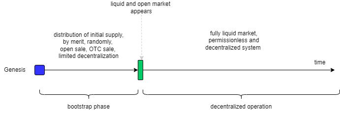

# Being permissionless. Bootstrap

The concepts of "being permissionless," "trustless," and "decentralized" are common in the crypto space. Even there are formal [rigorous definition](https://arxiv.org/abs/2304.14701) of permissionless-ness, usage of it these concepts are context-dependent may not be entirely correct of even misleading

In Proxima's narrative, we claim that *Proxima is as permissionless as Bitcoin*. Naturally, Proxima and PoW networks differ fundamentally due to how consensus is achieved. Formally speaking, cooperative consensus does not belong to the _fully permissionless_ according to the aforementioned [framework ](https://arxiv.org/abs/2304.14701) (even though we believe it approximates it very closely). It is fair to expect a more detailed explanation of what exactly we mean by our claim.

The importance of being permissionless is especially significant at the bootstrap stage of the network because it relates to the idea of the *fair launch*, a sensitive topic whenever the start of a new distributed ledger is considered.

The general narrative is that PoW is permissionless and therefore fair at launch, while PoS is permission-ed (or less permission-less) and therefore not very fair. There are strong arguments for this.

Proxima is not PoW, nor is it PBFT PoS (no committees, no staking). Yet, its Sybil-resistance its security is based on the ownership of the tokens on the same ledger, similar to PoS. Delegation is also very similar to analogous feature of PoS blockchains. 

So, what might be a fair launch in Proxima? We have to cover these legitimate and controversial questions. We will analyze idealized and simplified scenarios.

## Bootstrap in PoW

PoW networks (Bitcoin, Kaspa, Ethereum classic, etc.) are commonly considered permissionless in all aspects: one does not need permission to participate in the network in any role. Anybody can start a mining operation and, of course, use the network for holding and moving tokens.

This includes the bootstrap stage of the ledger. Initially, the ledger has zero tokens and no participants. If somebody wants to join at genesis, they must earn new tokens by mining. This means investing into computers, ASICs, and starting to earn tokens. That's it. Even block 0 can be mined in a decentralized way. 

However, the very genesis of PoW is centralized and trust-based because:
- the node software with the protocol code and ledger validity definitions must be distributed from one single (trusted) point;
- the gossip network for the inception phase must be some kind of social consensus among participants before the start, i.e. all participants must have open and equal access.

In other words, initial participants rely on centralized coordination by public trusted reference point. How a participant decides to be in that set? By knowing and trusting the GitHub repository and by being able to join the bootstrap network. These are public constants, so, anybody informed (essentially insiders) can join since the beginning by downloading and running the node.

They also must be motivated to invest in the mining equipment and start incurring CAPEX and mining costs, even if small at the beginning. By investing into the mining, initial miners to a certain extent commit to the network.

So, the genesis in the PoW bootstrap is a permissionless procedure, yet it relies on a centralized trust and is coordinated among limited number of potential participants. Besides, in the initial phases the network is vulnerable to majority takeovers (51% attack) until total amount of involved hashrate becomes significant.

Initial miners start mining blocks and new tokens. Total hashrate and security grows. Then they want to cover their costs. For that, they sell their mined tokens to other participants. This way, the token becomes liquid. The price of the token grows (for any reason), making mining operations more profitable, and the profit attracts more miners. 

In the end, the liquidity of the tokens will keep the network running with the dependency higher the token price -> higher hashrate -> higher security (reverse is also true).

## Bootstrap in PoS
The story above is different for PoS, especially at inception. This is due to two things:
1. PoS usually has some kind of PBFT committee of validators. The committee must be created somehow.
2. The validators must be staked, i.e., they must start having a vested interest and declare their commitment to the future of the ledger. This is the basis of PoS security.

So, the creator, a trusted entity, must create ("pre-mine") some tokens in genesis ledger state and give them (usually sell them) to the initial validators. This binds them to the ledger.

Investing in the initial supply of tokens is economically equivalent to investing in mining infrastructure in PoW. Cost of the invested capital becomes CAPEX. That investment is a sunk cost because it becomes a real cost if some initial validator decides to leave. Thus, the validator acquires a vested interest in the ledger.

The difference with PoW is that in PoS the creator not only provides trusted public point of reference, but also decides to whom to sell the initial supply. Likewise, the initial validators decide in which ledger to engage by buying the initial stake. So, at the inception, the relationship between the creator and initial validators is centralized and trust-based.

It is often seen the bootstrap of PoW is radically different for PoS, however, at a closer look, they are quite similar.  

The future of the network and its security develops together with the liquidity of the token. Validators require interest on their stakes to cover costs, so they need an open and liquid market for tokens. Looking from this perspective, the picture is not very different from PoW.

However, if some validators decide to leave for any reason (even at great cost), or, for some reason, the current committee fails to agree on the next one, the committee may fall apart and the ledger will stop.

The essential aspect of PBFT PoS is that it remains only *conditionally decentralized* and "quasi-permissionless" even after the bootstrap phase: the committee is a permissioned structure by its nature. Even with random rotation procedures, the committee must be proposed somehow by somebody, and then the committee itself must reach full consensus on its composition. This means another layer of trust assumptions in the system.

## Bootstrap of Proxima
There is no committee in Proxima. Sequencers do not care about each other's state and opinions; they just follow the biggest ledger coverage rule. It is a [Nakamoto consensus](https://medium.com/@lunfardo/on-definition-of-nakamoto-consensus-be8f4b84c899). Becoming a sequencer is as permissionless as the market of tokens is open, liquid, and permissionless. After somebody acquires tokens, no need for any permission to be a sequencer or any other chosen role. Censoring someone's possession of tokens is not possible too.

So, we need (permissionless) liquidity of the token for the existence of the distributed ledger: the same thing in PoW, PoS, and Proxima.

Proxima needs some tokens "pre-mined" in the initial supply. The creator of the ledger must create some $N$ tokens at the beginning and then distribute (usually sell) them to initial token holders, which will become first sequencers or delegators to first sequencers.

So, at the very inception, the situation in Proxima is strongly similar to PoS: it is trust-based and centralized coordination among initial participants of the future ledger, a community, which follow social consensus among them.  

Proxima explicitly emphasizes **social consensus** and **cooperation** (as opposed to competition) in the community of token holders as fundamental principle of the existence of the Proxima's ledger. The protocol provides technical means of coordinating that social consensus.

The way the network is launched will also protect it from the hostile takeovers in the initial phases: one cannot influence the network without committing to it long term by buying tokens. So, the price barrier is set by those who are already committed.

At the inception, it is trust-based and coordinated in centralized or conditionally decentralized manner. However, after inception, when the liquid market of tokens appear, the situation becomes radically different from PBFT PoS and becomes equivalent to PoW. The system becomes fully permissionless due to assumed liquidity of the token. 
Anybody who can buy tokens (think ASICs) can run a sequencer (think miner) and earn inflation.

This is what we mean by *Proxima is as permissionless as Bitcoin*. At the inception phase, however, Bitcoin and other PoW are somewhat different from Proxima.

One may see Proxima at inception as less permissionless and less fair than Bitcoin. We can live with that, given the significant differences in the underlying tech and its operating costs. Besides, inception is just a short moment in the long history of the ledger, so initial distribution does not matter in the long term, provided the distributed ledger survives until then.

## Conclusions
- The long-term development of the network is market-driven, permissionless and decentralized, equally for PoW and Proxima.
- At the inception, the relationship between the initiators of the network is trust-based and centrally coordinated in any case, even in PoW.
- In PoW, inception is permissionless to a significant extent, so it is perceived as fair.
- In Proxima, like in PoS, it requires initial distribution of tokens, which may or may not be perceived as fair.
- Naturally, the initial supply is distributed to the initial set of token holders by selling it. This fact itself creates liquidity and commitment from the very beginning.

## Variations
What could be alternatives or variations of the PoS-style of genesis inception in Proxima?

The sensitive part is the fairness of the initial distribution. Note that even merits-based distribution of the initial supply may be perceived as unfair by some. In the initial phase, some people may feel the initial distribution as unfair because nobody sold tokens to them at an acceptable price. Or something else. Meanwhile, in PoW, "open doors policy" is perceived as fair to many of those informed. However, it may look less fair to those with big merits and contributions in the phase which precedes the genesis.

The above hints about the "impossibility of perfection" situation.

Mitigation of the problem would be creating a liquid market as early as possible. For example, it could be some kind of open and permissionless sale of the initial supply. This would work if the initial sale were truly open and transparent, without any bias or censorship. However, it is not easy to guarantee that.

Another range of options is to consider truly random (and therefore perceived as fair) distribution of initial supply among anybody informed.

The implementation may range from using the PoW mining principle (on another blockchain or standalone) for the randomization and commitment ("proof of cost"), to other principles such as *verifiably random function* for pure non-playable randomized distribution.

