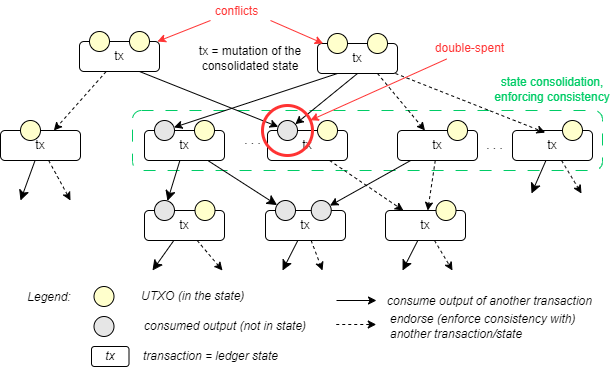

UTXO ledger
---
Proxima uses UTXO (**U**nspent **T**ransa**X**tion **O**utput) as its ledger model. 

A classical UTXO transaction presents an update to the **ledger state**. A UTXO transaction:
1. **consumes** (**spends**) outputs on the ledger state,
2. deletes them from there, and
3. **produces** (creates)  new outputs on the next ledger state.

More detailed description of the UTXO model can be found in [Proxima transaction model](https://lunfardo314.github.io/#/txdocs/intro). 

### Conflicts. DAG. Past cone

Two or more transactions that directly or indirectly consume (spend) the same output in the ledger state are considered *conflicts* or *double-spends*. A valid ledger cannot contain conflicting transactions. The set of UTXO transactions as vertices with the relation of consumption of outputs between them as edges naturally forms a *directed acyclic graph* (DAG).

The *past cone* of transaction $T$ consists of all transactions reachable along the consumption links and [endorsement](#endorsements) (below) back to a **baseline** ledger state. 
Baseline is explicitly defined for any past cone of consideration. The _past cone_ defines how transaction $T$ was derived from the baseline. 
The **genesis ledger state** is a baseline of the full past cone, because it includes full history of the transaction $T$. 
Transaction $T$ cryptographically _commits_ to any of its past cones and therefore **past cone is deterministic and immutable**.  

The past cone of the transaction cannot contain conflicting transactions: this is the definition of the consistency of the ledger. 
Each past cone of transaction $T$ is a consistent ledger of transactions that transforms the baseline ledger state to a ledger state denoted as $S_T$. 
Each UTXO transaction $T$ represents a individual and consistent ledger state $S_T$. This is hallmark property of the UTXO model.

### Endorsements

Proxima's UTXO model adds new element to the UTXO transaction: a link to another UTXO transaction called **endorsements**. Technically, *endorsement* is an ID of another transaction. This reference is part of the transaction, i.e., the endorsement is signed by the token holder who produces the transaction. Transaction can contain none or several endorsements of other transactions.

By putting endorsement into transactions, users enforce consistency of the referenced past cone. This way, the Proxima's transaction not only transforms some ledger state by consuming and producing outputs but also makes a statement on the ledger about consistency of the new transaction with other transactions. Proxima's cooperative consensus heavily relies on this feature.

### Canonic order
Each UTXO transaction is deterministic and immutable, i.e. treated equally by each node. In particular, all inputs and endorsements have their indices fixed in the transaction, i.e. they are **deterministically pre-ordered**.

Deterministic order of outgoing vertices in the DAG makes the whole dag deterministic. It defines _canonic order_ among transactions. Important property of the UTXO ledger:

**History of each UTXO transaction is always canonically ordered and deterministic.**

This makes it fundamentally different from non-deterministic account-based transaction models

### UTXO tangle

**UTXO tangle** is a DAG where UTXO transactions are vertices, and output consumption links and endorsements are edges. Each vertex (transaction) represents a consistent ledger state, i.e., it's past cone cannot contain conflicts. However, two transactions on the UTXO tangle can be conflicting, which means their corresponding ledger states cannot be consolidated into one by a transaction.

 

### No blocks. No sequencing

The UTXO tangle is the main data structure of Proxima: a **transaction DAG**. It contains **all** the information for calculation of all possible versions of the ledger state.

In this approach, there's no need for blocks that must be sequenced before calculating the final ledger state, like in blockchains and blockDAGs.

The purpose of the consensus in Proxima is to choose one ledger state by orphaning other conflicting ones from the history of the chosen ledger.

Blockchains and blockDAGs need sequencing in order to resolve conflicts (double spends). In Proxima, consensus resolves conflicts without the need for consensus on the order, because it is already there.

