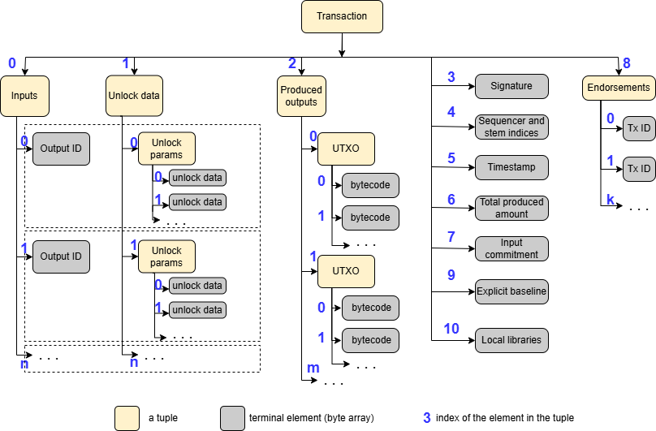
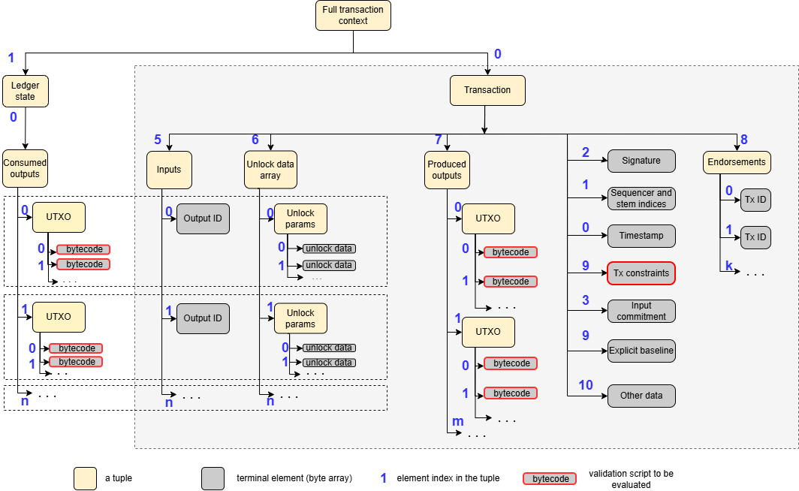
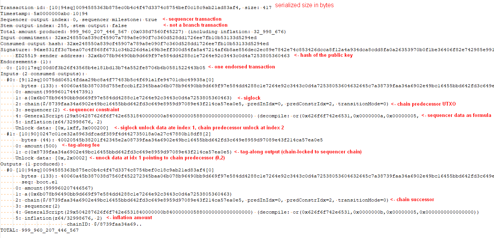

# Proxima transaction

## Tuple trees
When composing a transaction, we aim to use the most generic data structures possible:

* A **byte array**, which may be empty (i.e., of zero length). A byte array can have any length (subject to practical limits imposed in the protocol).
* A **tuple** $(e_0, \dots, e_{n-1})$, where each $e_i$ is either a byte array or another tuple.

Nested tuples can represent a finite hierarchical data structure — a **tree** — where byte arrays are terminal elements and tuples are internal nodes.

Each Proxima transaction is represented as such a tree of tuples. Let $T$ be such a tree. Every element in the tree has a unique **path** $(i_0, \dots, i_{m-1})$ that specifies its position within the structure. The empty path $()$ refers to the root of the tree — the top-level tuple. Every part of the transaction has its own path, which acts as a unique address within the transaction.

For a tuple $T$, we denote its $i$-th element as $T_i$. In the hierarchical case, the element at path $(i_0, \dots, i_{m-1})$ is denoted:
$$
T_{i_0,\dots i_{m-1}} = ((T_{i_0})_{i_1}\dots)_{i_{m-1}}
$$

We use $len(T)$ to denote the number of elements in the tuple:
$$
T = (T_0, \dots T_{len(T)-1})
$$
Similarly, $len(b)$ is number of bytes in the byte array $b$.

## Serialization of tuples

Let $bytes(e)$ be a function that returns the serialized binary representation of element $e$ as a byte array. The serialization rules are minimal and straightforward:

* The serialized form of a byte array $b$ is itself: $bytes(b) = b$.
* The serialized form of a tuple $T = (e_0, \dots, e_{n-1})$ is:
$$
bytes(T) = header(n, l)||e'_0||\dots||e'_{n-1}
$$ 
where
  * $||$ denotes concatenation
  * $header(n, l)$ is 2 bytes containing the number of elements in the tuple, and $l$ is the number of bytes reserved for size prefixes of elements. The parameter $l$ is selected such that each element size can fit in $l$ bytes (e.g., $l = 1$ for elements ≤ 255 bytes, or $l = 2$ for ≤ $2^{16} - 1$ bytes),
  * $e'_i = sz^l_i || bytes(e_i)$, where $sz^l_i$ is $len(bytes(e_i))$ encoded in $l$ bytes (big-endian). That is, $e'_i$ is $bytes(e_i)$ prefixed with its length.

Tuple serialization rule is applied recursively down to the terminal byte arrays. The serialized transaction is a nested binary blob.

Note that in the serialized form, an element does not carry information about whether it is terminal: a byte array may or may not represent a serialized tuple. This implies serialization is intended only for **finite** tuple trees — structures with a known layout that require no recursion or looping to traverse.

This is intentional: the user of a serialized tuple tree must know in advance whether a particular path $(i_0, \dots, i_{m-1})$ is valid. Attempting to access an invalid path causes an exception and immediate invalidation of the structure. This trait enables **lazy deserialization** — parts of the tree can be deserialized only when needed.

These data structures are low-level binary representations. Serialization relies only on basic primitives, is platform-independent, and has no dependency on language-specific types or mechanisms like Protobuf. The Go implementation is available at [github.com/lunfardo314/easyfl/tree/develop/tuples](https://github.com/lunfardo314/easyfl/tree/develop/tuples).

## Raw transaction

We distinguish two forms of a Proxima transaction:

* **Raw transaction**, also known as canonical or transferable transaction: the form exchanged between nodes, persisted, and stored.
* **Full transaction context**: the raw transaction extended with the fragment of the ledger state it modifies. This form is transient and used only for validation.

The *raw transaction* is a tuple of 11 elements:

| Index | Name                      | Description                                                                                                                    |
|-------|---------------------------|--------------------------------------------------------------------------------------------------------------------------------|
| 0     | Timestamp                 | Terminal element: 5 bytes encoding _ledger time_                                                                               |
| 1     | Sequencer data bytes      | Terminal element: 0 for non sequencer transactions, 2 bytes encoding sequencer-related indices                                 |
| 2     | Signature data            | Terminal element: 1 byte of signature type + signature of the transaction ID, that includes public key                         |
| 3     | Input commitment          | Terminal element: hash of all consumed outputs                                                                                 |
| 4     | Explicit baseline         | Terminal element: optional transaction ID indicating a branch                                                                  |
| 5     | Inputs                    | Non-empty tuple of up to 256 output IDs of consumed UTXOs (not the outputs themselves)                                         |
| 6     | Unlock data               | Tuple of **unlock parameters**; one per input. Each unlock parameter is a tuple itself                                         |
| 7     | Produced outputs          | Non-empty tuple of up to 256 newly created outputs                                                                             |
| 8     | Endorsements              | Tuple of up to 8 transaction IDs                                                                                               |
| 9     | Transaction level scripts | Tuple of transaction level constraint scripts. Empty in most cases                                                             |
| 10    | Other data                | Tuple; any other data, a tuple of byte arrays. May contain any additional data referenced by constraint scripts. Usually empty |

E.g. for a transaction $T$, element $T_5$ is the tuple of inputs; $T_8$ is the tuple of endorsements. The i-th produced output is $T_{7,i}$.

## Full transaction context

Let $utxo(id)$ denote the UTXO loaded from the ledger state by its ID.

Given $T = (T_0, \dots, T_{10})$, define:
$$
consumed(T) = (utxo(T_{0,0}), utxo(T_{0,1}) \dots utxo(T_{0,len(T_0)-1}))
$$

The **transaction context** $T^{ctx}$ is defined as:
$$
T^{ctx}=(T, (consumed(T)))
$$

The transaction context $T^{ctx}$ contains all the information required to validate transaction $T$. It includes the transaction itself and the consumed outputs, with all elements accessible by path.

It always holds that $T^{ctx}0 = T$ and $T{path} = T^{ctx}_{0,path}$.
Path to the i-th input in the transaction context is $(0,0,i)$.

From this, we can derive:
* The ID of the consumed output: $T^{ctx}_{0,0,i}$
* The corresponding consumed output: $T^{ctx}_{1,0,i}$
* The corresponding unlock-parameters: $T^{ctx}_{0,1,i}$

## Validation scripts
The UTXO model often supports programmable validity, like [Bitcoin Script](https://en.bitcoin.it/wiki/Script). This allows the transaction producer to define custom unlock and validation logic, also known as **covenants**, embedded in the UTXO, to be evaluated by the node.

In Proxima, each UTXO is a tuple of terminal elements $(c_0, \dots, c_{k-1})$, where each $c_i$ is a script bytecode.

All transaction data — amounts, addresses, etc. — are wrapped in scripts. There are no standalone "data fields." Scripts can access any element in $T^{ctx}$ and enforce **logical relations** between them: within a single UTXO, across inputs and outputs, etc.

A simple functional language, [EasyFL](txdocs/easyfl.md), is used for scripting. Each script is a closed formula — a composition of function calls and data, serialized as bytecode.

These formulas serve two roles:
* As **validation constraints** over $T^{ctx}$,
* As **serialization descriptors** for UTXO data.

## Validation of the transaction
Nodes apply globally trusted rules to determine if transaction $T$ is valid or not by running hardcoded validation code and validation scripts that come with transaction and UTXOs. Invalid transactions are rejected immediately.

Validation of the transaction goes in 3 stages:

### Stage 1. Identification
Raw transaction data is parsed into the tuple tree and main elements are checked:
- timestamp data is parsed
- sequencer data is parsed
- all tuple elements except signature are hashed
- transaction ID is determined

If any of the steps fail, i.e. it is impossible to determine transaction ID, data blob is not considered as a transaction and is discarded.

Stage 1 validation is run immediately after the transaction enters the node and before gossiping it to peers. I.e. only data blobs identifiable as transactions are gossiped among peers.

### Stage 2. Validation in the partial context
This is the validation that does not require full context, i.e. can be run without knowing consumed UTXOs.

- Identified transaction is scanned to check syntactical validity of input IDs, produced outputs and other constraint that require iteration over variable parts of the transaction.
- total produced amount is summed up
- in advance known validation script, that does not require access to the full context, is run. The script checks validity of the signature, among other things.

If any of these steps fails, transaction is discarded as invalid.

Stage 2 validation is performed by the node after transaction passes all spam and DoS prevention filters and before attaching it to the UTXO DAG

### Stage 3. Validation in the full context
After (and if) all consumed UTXOs of the transaction are determined, full context of the transaction is formed. Stage 3 validations means:
- running all transaction level validation scripts, if any
- running all validation scripts in consumed and produced UTXOs
- summing up amounts in the consumed outputs and checking if consumed total amount of tokens plus inflation is equal to the produced amount.

Transaction is discarded if any of check fail.

I.e. for a transaction $T$ to be valid, all its scripts must return true when evaluated. Transaction producers embed these scripts into UTXOs to enforce desired behavior for both creation and later consumption.

Examples:

* `amount(100)` invokes the `amount` function with argument `100`. It wraps `100` with the amount descriptor. The function check validity of the provided amount. The bytecode of `amount(100)` can be parsed to retrieve both the function and the data.
* `sigLock(0x3705...)` checks that the hash of the public key coming as part of the signature matches the provided hash and that the transaction signature is valid. 

All participants share a globally trusted **library of validation function definitions**. Some are hardcoded (_embedded_); most are open formulas defined in EasyFL (_extended_).

For fundamental reasons, these definitions avoid loops and recursion — they are **intentionally not Turing-complete**.

## Example of the transaction printout

The following is an example of the human-readable printout of the transaction context. 
It is a sequencer transaction, with two consumed outputs, chain predecessor and tag-along output, and one produced output, the successor of the chain. 
Each consumed and produced outputs is composed as a tuple of constraint formulas, here displayed in the decompiled form.

The `GeneralScript` denotes arbitrary formula bytecode, placed in the UTXO. In this case, sequencer hardcoded `or` function (which always evaluates to `true`), to wrap arbitrary data, produced by the sequencer (sequencer name, chain height, etc.). The data can be parsed out from the transaction by using standard tools. 

The transaction consolidates tag-along fee and inflates its input tokens in its produced amount.

