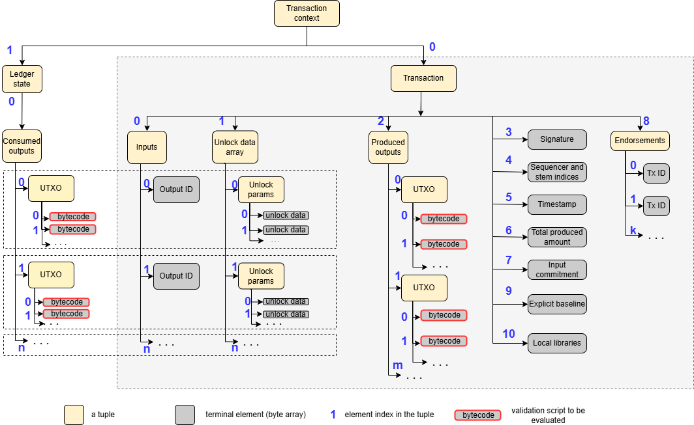

# Proxima transaction

## Tuple trees
When composing a transaction, we aim to use the most generic data structures possible:

* A **byte array**, which may be empty (i.e., of zero length). A byte array can have any length (subject to practical limits set by the protocol).
* A **tuple** $(e_0, \dots, e_{n-1})$, where each $e_i$ is either a byte array or another tuple.

Nested tuples can represent a finite hierarchical data structure — a **tree** — where byte arrays are terminal elements and tuples are internal nodes.

Each Proxima transaction is represented as such a tree of tuples. Let $T$ be such a tree. Every element in the tree has a unique **path** $(i_0, \dots, i_{m-1})$ that specifies its position within the structure. The empty path $()$ refers to the root of the tree — the top-level tuple. Every part of the transaction has its own path, which acts as a unique address within the transaction.

For a tuple $T$, we denote its $i$-th element as $T_i$. In the hierarchical case, the element at path $(i_0, \dots, i_{m-1})$ is denoted:
$$
T_{i_0,\dots i_{m-1}} = ((T_{i_0})_{i_1}\dots)_{i_{m-1}}
$$

We use $len(T)$ to denote the number of elements in the tuple:
$$
T = (T_0, \dots T_{len(T)-1})
$$
Similarly, $len(b)$ is number of bytes in the byte array $b$.

## Serialization

Let $bytes(e)$ be a function that returns the serialized binary representation of element $e$ as a byte array. The serialization rules are minimal and straightforward:

* The serialized form of a byte array $b$ is itself: $bytes(b) = b$.
* The serialized form of a tuple $T = (e_0, \dots, e_{n-1})$ is:
$$
bytes(T) = header(n, l)||e'_0||\dots||e'_{n-1}
$$ 
where
  * $||$ denotes concatenation
  * $header(n, l)$ is 2 bytes containing the number of elements in the tuple, and $l$ is the number of bytes reserved for size prefixes of elements. The parameter $l$ is selected such that each element size can fit in $l$ bytes (e.g., $l = 1$ for elements ≤ 255 bytes, or $l = 2$ for ≤ $2^{16} - 1$ bytes),
  * $e'_i = sz^l_i || bytes(e_i)$, where $sz^l_i$ is $len(bytes(e_i))$ encoded in $l$ bytes (big-endian). That is, $e'_i$ is $bytes(e_i)$ prefixed with its length.

Tuple serialization rule is applied recursively down to the terminal byte arrays. The serialized transaction is a nested binary blob.

Note that in the serialized form, an element does not carry information about whether it is terminal: a byte array may or may not represent a serialized tuple. This implies serialization is intended only for **finite** tuple trees — structures with a known layout that require no recursion or looping to traverse.

This is intentional: the user of a serialized tuple tree must know in advance whether a particular path $(i_0, \dots, i_{m-1})$ is valid. Attempting to access an invalid path causes an exception and immediate invalidation of the structure. This trait enables **lazy deserialization** — parts of the tree can be deserialized only when needed.

These data structures are low-level binary representations. Serialization relies only on basic primitives, is platform-independent, and has no dependency on language-specific types or mechanisms like Protobuf. A Go implementation is available at [github.com/lunfardo314/easyfl/tree/develop/tuples](https://github.com/lunfardo314/easyfl/tree/develop/tuples).

## Raw transaction

We distinguish two forms of a Proxima transaction:

* **Raw transaction**, also known as canonical or transferable transaction: the form exchanged between nodes, persisted, and stored.
* **Transaction context**: the raw transaction extended with the fragment of the ledger state it modifies. This form is transient and used only for validation.

The *raw transaction* is a tuple of 11 elements:

| Index | Name                              | Description                                                                                 |
|-------|-----------------------------------|---------------------------------------------------------------------------------------------|
| 0     | Inputs                            | Non-empty tuple of up to 256 output IDs of consumed UTXOs (not the outputs themselves)      |
| 1     | Unlock data                       | Tuple of **unlock parameters**; one per input                                               |
| 2     | Produced outputs                  | Non-empty tuple of up to 256 newly created outputs                                          |
| 3     | Endorsements                      | Tuple of up to 8 transaction IDs                                                            |
| 4     | Sequencer and stem output indices | Terminal element: 2 bytes encoding sequencer-related indices                                |
| 5     | Timestamp                         | Terminal element: 5 bytes encoding _ledger time_                                            |
| 6     | Signature                         | Terminal element: ED25519 signature of the transaction ID, along with the public key        |
| 7     | Input commitment                  | Terminal element: hash of all consumed outputs (not part of the transaction itself)         |
| 8     | Explicit baseline                 | Terminal element: optional transaction ID indicating a branch                               |
| 9     | Other data                        | Tuple; any other data, a tuple of byte arrays (usually empty)                               |

For a transaction $T$, element $T_0$ is the tuple of inputs; $T_6$ is the total produced amount. The i-th produced output is $T_{2,i}$.

## Transaction context

Let $utxo(id)$ denote the UTXO loaded from the ledger state by its ID.

Given $T = (T_0, \dots, T_{10})$, define:
$$
consumed(T) = (utxo(T_{0,0}), utxo(T_{0,1}) \dots utxo(T_{0,len(T_0)-1}))
$$

The **transaction context** $T^{ctx}$ is defined as:
$$
T^{ctx}=(T, (consumed(T)))
$$

The transaction context $T^{ctx}$ contains all the information required to validate transaction $T$. It includes the transaction itself and the consumed outputs, with all elements accessible by path.

It always holds that $T^{ctx}0 = T$ and $T{path} = T^{ctx}_{0,path}$.
Path to the i-th input in the transaction context is $(0,0,i)$.

From this, we can derive:
* The ID of the consumed output: $T^{ctx}_{0,0,i}$
* The corresponding consumed output: $T^{ctx}_{1,0,i}$
* The corresponding unlock parameters: $T^{ctx}_{0,1,i}$

## Outputs (UTXOs). Validation scripts/formulas
Nodes apply globally trusted rules to determine if transaction $T$ is valid. Invalid transactions are rejected immediately.

Validation rules apply to the transaction context $T^{ctx}$.

While rules are hardcoded in node software, the UTXO model often supports programmable validity, like [Bitcoin Script](https://en.bitcoin.it/wiki/Script). This allows the transaction producer to define custom unlock and validation logic, embedded in the UTXO, to be evaluated by the node.

In Proxima, each UTXO is a tuple of terminal elements $(c_0, \dots, c_{k-1})$, where each $c_i$ is a script bytecode.

All transaction data — amounts, addresses, etc. — are wrapped in scripts. There are no standalone "data fields." Scripts can access any element in $T^{ctx}$ and enforce **logical relations** between them: within a single UTXO, across inputs and outputs, etc.

A simple functional language, [EasyFL](txdocs/easyfl.md), is used for scripting. Each script is a closed formula — a composition of function calls and data, serialized as bytecode.

These formulas serve two roles:
* As **validation constraints** over $T^{ctx}$,
* As **serialization descriptors** for UTXO data.

For a transaction $T$ to be valid, all its scripts must return true when evaluated in the context of $T^{ctx}$. Transaction producers embed these scripts into UTXOs to enforce desired behavior for both creation and later consumption.

Examples:

* `amount(100)` invokes the `amount` function with argument `100`. It wraps `100` with the amount descriptor. The function may checks if the UTXO meets a minimum amount requirement. The bytecode can be parsed to retrieve both the function and the data.
* `addressED25519(0x3705...)` checks that the public key at $T_3$ matches the provided hash and that the transaction signature is valid. It acts as a **siglock**. The bytecode can also be inspected for function type and argument.

All participants share a globally trusted **library of validation function definitions**. Some are hardcoded like opcodes; most are open formulas defined in EasyFL.

For fundamental reasons, these definitions avoid loops and recursion — they are **intentionally not Turing-complete**.

## Example of the transaction printout

The following is an example of the human-readable printout of the transaction context. 
It is a sequencer transaction, with two consumed outputs, chain predecessor and tag-along output, and one produced output, the successor of the chain. 
Each consumed and produced outputs is composed as a tuple of constraint formulas, here displayed in the decompiled form.

The `GeneralScript` denotes arbitrary formula bytecode, placed in the UTXO. In this case, sequencer hardcoded `or` function (which always evaluates to `true`), to wrap arbitrary data, produced by the sequencer (sequencer name, chain height, etc.). The data can be parsed out from the transaction by using standard tools. 

The transaction consolidates tag-along fee and inflates its input tokens in its produced amount.

