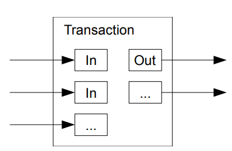
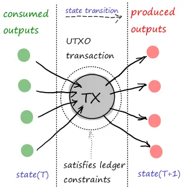

# Classical UTXO
*UTXO* is a ubiquitous and well known term in the crypto world. UTXO stands for **U**nspent **T**ransa**X**tion **O**utput.

Further in the text, we will use terms *UTXO* and *output* interchangeably as synonyms. [UTXO](https://en.wikipedia.org/wiki/Unspent_transaction_output) is also the name of the ledger model, made famous by Bitcoin.

## UTXO transaction

The humble picture of what will later be called UTXO transaction from the Bitcoin whitepaper:

UTXO transaction, among other things, has at least inputs and outputs, which we call respectively **consumed UTXOs** and **produced UTXOs**. It satisfies globally trusted set of validity rules also known as **validity constraints** or **ledger constraints**. The most obvious is balancing number of fungible tokens in inputs with number of fungible tokens in outputs.
UTXO transaction represents a deterministic update of the ledger state.

A bit more advanced picture, which, however, represents the same concept:

Proxima transaction is a data structure which, at it's core, is equivalent to the classical UTXO transaction. It's function in Proxima, however, spans far beyond a simple ledger update.

## Ledger state
Each UTXO has its *output ID*, a unique ID is assigned to the output when it starts its existence. Output IDs never repeat (while UTXO itself can).

The *ledger state* is a set of key-value pairs *(output ID, output)*, a database, where UTXO can be retrieved by its *output ID*.

History of the ledger starts from the *genesis ledger state*, which consists on 2 UTXOs (more below).

The transaction does not contain consumed output themselves, but instead contains *inputs*, the IDs of consumed outputs.

If the ledger state contains all IDs of outputs specified as inputs of the transaction, the latter is called *applicable* to the ledger state.

An applicable transaction updates (modifies) the ledger state the following way:
* **consumed outputs** are deleted from the ledger state
* **produced outputs** are added to the ledger state

Any valid ledger state is a result of incremental application of transactions, starting from the *genesis ledger state*.

The key fact of the UTXO model is that the resulting **ledger state is independent on the exact order** of how transactions were applied, as long as each of it was applicable. (similar to the jigsaw puzzle: no matter how you assemble it, the result is always the same). This is different from the account-based ledger models, where final ledger state depends on the order how transactions are applied.
